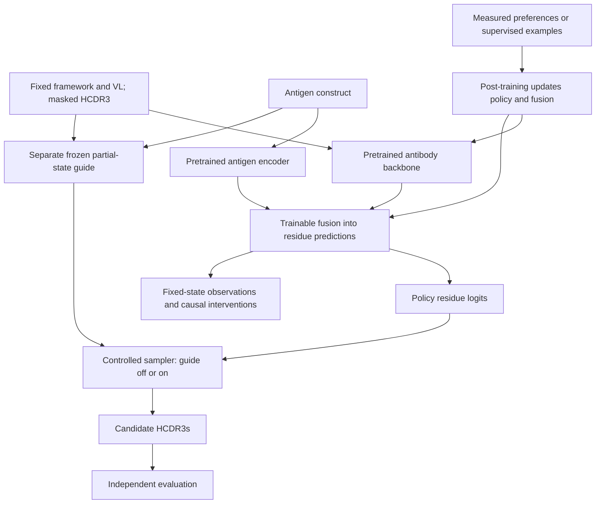

# Steerable antibody generation with pretrained antigen-conditioned policies

This project studies how antigen conditioning, inference-time guidance, and
post-training shape antibody generation. It focuses on **fixed-length HCDR3 editing
with the heavy-chain framework and light-chain context held fixed**. The aim is to
understand how a policy uses antigen information, how external guidance changes
sampling, and what post-training changes in the policy itself.

## Approach

The proposed architecture starts from a pretrained protein model, adapts VH/VL
behavior where needed, and fuses antigen information into residue predictions. A
separately trained, frozen property guide reweights candidate probabilities during
sampling. Post-training updates the policy and its trainable fusion components.

The generative design uses masked diffusion to complete HCDR3 from varying amounts
of observed context, with a matched partial-state baseline for comparison.
Supervised continuation provides the first weight-update baseline. Preference
methods are evaluated on pairs with the same antigen, framework, light-chain
context, and edit length, under comparable assay conditions.

The guide supplies predictions to the sampler; its hidden representations do not
enter the policy. This separates guidance during generation from changes learned
through post-training.

## Experimental design

Antigen conditioning is evaluated by holding antibody context fixed and comparing
HCDR3 predictions across antigens against held-out measurements. The experiment
uses one conditioned parent policy, a separately trained frozen guide, and the
same sampling protocol in four arms:

| Policy | Guide off | Guide on |
|---|---|---|
| Before post-training | A: conditioning baseline | B: guidance effect |
| After post-training | C: learned policy change | D: combined intervention |

The comparisons `C - A`, `B - A`, and `D - C` measure the effects of post-training
and guidance on withheld experimental outcomes. Crossing the policy's and guide's
antigen inputs independently identifies which component supplies specificity.
Sampling-plus-reranking and supervised-continuation controls use declared budgets.
Biological improvement requires independent measurements; guide scores alone
cannot establish it.

Mechanistic analysis holds corrupted antibody states, masks, positions, and time
levels fixed, then compares antigen contexts and intervenes on aligned fusion
activations before and after post-training. These interventions examine what the
policy computes at a given input. Trajectory analysis examines which inputs a
guided sampler visits. Sparse internal features are a later diagnostic option.

## Documentation

- [Research design and implementation plan](reference/research-design.md):
  experimental controls, post-training requirements, and the research roadmap.
- [Custom-model workflow](reference/custom-model-workflow.md):
  data preparation, training settings, checkpoint compatibility, and infill commands.
- [Decision 0003](specs/decisions/0003-pretrained-conditioned-policy.md) and the
  [migration specification](specs/pretrained_conditioned_policy.md):
  the accepted architecture and implementation boundaries.

## Current capabilities

The repository provides a custom antibody model and supporting tools:

| Area | Available implementation |
|---|---|
| Data and evaluation | OAS/ASD preparation, target identity and leakage audits, frozen inputs and HCDR3 contrast scoring |
| Antibody policy | Custom antibody MLM and VH/VL refinement |
| Antigen fusion | Cross-attention into antibody residue logits; optional frozen/LoRA ESM antigen encoder |
| Sampling and guidance | Single-pass and iterative HCDR3 infill; optional external guide |
| Generative objective | MLM, partial-state masking and mask-rate schedules |
| Interpretability | Synthetic antigen-pathway probe |

The pretrained antibody backbone, controlled experiment runner, masked-diffusion
objective, and preference trainer are not yet integrated. The existing ESM option
replaces only the antigen encoder.

The checkout has no antibody-antigen corpus, benchmark manifests are incomplete,
and training hardware measurements are unrecorded. Implemented components alone
do not establish that a trained checkpoint meets the scientific criteria.
