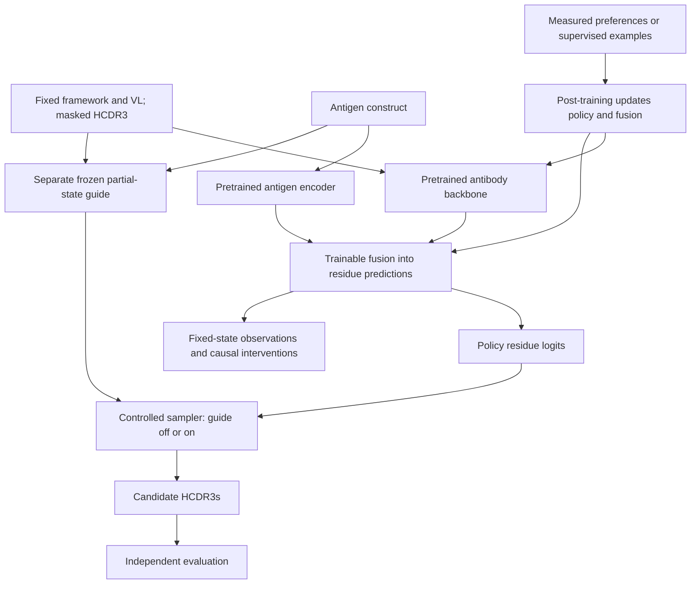

# Steerable Antibody Generation with Pretrained Antigen-Conditioned Policies

This project studies how antigen information changes antibody generation, how
post-training changes that behavior, and how an external property guide interacts
with the resulting policy. The initial task is **fixed-length HCDR3 editing with
heavy-chain framework and light-chain context held fixed**.

**Current direction (2026-09-09):** initialize from a pretrained protein model,
adapt VH/VL behavior where needed, and fuse antigen information into the residue
prediction pathway. Establish measured antigen-specific behavior before promoting
post-training or interpretability claims. Scratch antibody pretraining is an
optional research control, not a prerequisite.

**First milestone:** holding the antibody context fixed, changing the antigen
changes HCDR3 predictions in agreement with held-out measurements. A better
compatibility classifier or a response to an unmeasured antigen swap alone is
insufficient.

Read [Decision 0003](specs/decisions/0003-pretrained-conditioned-policy.md) for the
accepted direction and the [migration specification](specs/pretrained_conditioned_policy.md)
for code boundaries, work order, and completion evidence. The migration is planned;
this README does not claim that a pretrained antibody policy is already integrated.

## Current implementation

| Capability | What exists today | What remains for the new direction |
|---|---|---|
| Data and evaluation | OAS/ASD preparation, target identity and leakage audits, frozen inputs and HCDR3 contrast scoring | A verified measured antigen-variant pilot with sealed evaluation labels |
| Antibody policy | Custom antibody MLM and VH/VL refinement | Pretrained antibody backbone, native tokenizer/head, loading and provenance |
| Antigen fusion | Cross-attention into antibody residue logits; optional frozen/LoRA ESM antigen encoder | Adaptation and measured conditioning gates on the pretrained policy |
| Sampling and guidance | Single-pass and iterative HCDR3 infill; optional external guide | Same sampler in guide-off/on arms, independent antigen inputs, replayable traces |
| Generative objective | MLM, partial-state masking and mask-rate schedules | Specified masked-diffusion objective and compatible sampler |
| Post-training | No preference trainer | Supervised baseline, then a tested diffusion preference estimator |
| Interpretability | Synthetic antigen-pathway probe | Fixed-state activation capture and causal fusion interventions; SAEs later |

The existing ESM option replaces **only the antigen encoder**. It is not a
pretrained antibody backbone. Existing code capabilities also do not establish
that a trained checkpoint passes the scientific gates.

## Research roadmap

1. **Freeze one conditional pilot and integrate one pretrained backbone.** Pin
   weights/revision, tokenizer, objective, usage terms, biological cases, and the
   actual compute budget. DPLM and ESM-family models, including VESM, are candidates;
   none is selected. Preserve upstream residue predictions before adding fusion.
2. **Adapt pairing and antigen conditioning.** Train antigen access into residue
   predictions and address measured VH/VL deficits. Preserve earlier capabilities.
   Evaluate correct antigen, matched substitutions, and measured antigen variants
   with guide off, including a fully masked HCDR3.
3. **Establish the generative contract.** Continue a conditioned MLM under a
   specified masked-diffusion objective, or adapt a diffusion checkpoint under its
   native objective. Keep an appropriate partial-state control and recheck
   conditioning. Diffusion is a generative choice, not a universal prerequisite
   for valid post-training.
4. **Establish guidance and causal baselines.** Validate a separate guide on the
   partial states it will encounter. Capture fixed-state activations before
   post-training and intervene on the antigen-to-residue pathway.
5. **Compare post-training and guidance.** Start with supervised continuation,
   then evaluate a specified preference method on trustworthy pairs. Run the
   before/after policy comparison with guide off/on and repeat the causal probes.

For a pretrained diffusion backbone, its generative contract is specified before
conditional training; there is no required second round of general-protein
pretraining. SAEs, variable-length design, structure co-design, and broad optimizer
sweeps follow evidence from the initial experiment.

**Current readiness:** this checkout has no antibody-antigen corpus, the three
benchmark manifests still contain owner sentinels and empty file lists, and the
actual training GPU/VRAM is unrecorded. Data acquisition/provenance and the training
machine measurement are active M01 work alongside mechanical interface preparation.
Run `nvidia-smi --query-gpu=name,memory.total --format=csv` on the training machine.
The local CPU Mac and the earlier 4 GB planning assumption do not select a backbone.
M03 conditional training needs M01's verified data and hardware evidence; a working
adapter alone does not unblock it.

## Where steering lives

| Intervention | What changes | Evidence needed |
|---|---|---|
| Antigen conditioning | The policy's predictions at a fixed antibody state | Measured antigen response beyond identity and study shortcuts |
| Inference-time guidance | The sampling distribution using a separate predictor | Improvement under a controlled sampler and independent evaluation |
| Post-training | Policy parameters, including any trainable fusion | Guide-off gains with conditioning and retention preserved |
| Causal interpretation | Selected activations or antigen access during a diagnostic | Controlled transfer/ablation of a reproducible policy response |

Guidance reweights the policy's candidate probabilities. Exact zero support cannot
be recovered by finite multiplicative weights; small nonzero probability can be
amplified when the guide favors it sufficiently. The reachability probe measures
local limitations for a specified state, guide and scoring rule, not a universal
ceiling on all possible generation paths.

With fixed inputs and deterministic evaluation, an external guide does not change
a frozen policy's forward activations. Guidance changes sampled residues, which
changes later inputs and activations. Comparing free-running trajectories alone
therefore cannot establish that the policy learned the guide's representation.

## Main experiment

Use one conditioned parent, a separately trained frozen guide, and the same sampler
protocol in all four arms:

| Policy | Guide off | Guide on |
|---|---|---|
| Before post-training | A: conditioning baseline | B: guidance effect |
| After post-training | C: learned policy change | D: combined intervention |

Measure `C - A`, `B - A`, and `D - C` on withheld experimental outcomes. Cross the
antigen inputs to policy and guide independently to identify which component
supplies specificity. Include sampling-plus-reranking and supervised-continuation
controls with declared budgets. Unmeasured generations remain candidates, not
experimentally validated improvements.

For mechanistic analysis, hold corrupted antibody states, masks, positions, and
time levels fixed. Compare antigen contexts and intervene on aligned fusion
activations within each checkpoint. Repeat before and after post-training. Probe
accuracy, attention maps, and guide-score improvements alone cannot establish
causal antigen use or improved binding.

## Post-training contract

**Status: planned, not implemented.** The policy, external guide, frozen preference
reference, and final evaluator have distinct roles. Preferred/dispreferred examples
must share antigen, framework, light-chain context, edit length, and comparable
assay conditions; uncertainty and censoring must permit an ordering.

For the planned diffusion-DPO path, the future `specs/masked_diffusion.md` and
`specs/diffusion_dpo.md` must define the process, estimator, policy/reference
corruption reuse, winner/loser coupling, weighting/reduction, sampling budget,
reference behavior, and enumerable toy tests before trainer code. Neither contract
exists yet; the migration specification does not stand in for them.

MLM pseudo-likelihood, fully masked marginal scores, trajectory log probabilities,
and the evaluation-time order-mixture `E-hat` are distinct quantities. None becomes
an exact diffusion sequence log probability by being fed into DPO. Separate the
variational-surrogate gap from the bias introduced by noisy estimates inside a
nonlinear preference loss. See the
[diffusion and post-training boundaries](specs/pretrained_conditioned_policy.md#diffusion-and-post-training-boundaries).

Supervised continuation on measured desirable examples is the first weight-update
baseline. DPO/VRPO is a candidate when trustworthy pairs exist. GRPO and iterative
preference loops additionally need reliable evaluation of new candidates and
sampler-compatible estimators. Scores from the guide cannot both define success
and establish that optimizing against that guide improved biology.

## Existing custom-model workflow

The following data commands, training settings, configs and infill examples
currently run the custom-model implementation. They remain useful for controls and
reproduction. They do not implement the new pretrained path, and completing the
scratch OAS → paired → antigen → infill checkpoint chain is not a dependency of the
new roadmap. J11/J24 specs retain their historical experiment scope.

Resume requires exact agreement on architecture, effective configuration,
tokenizer, and data. Source and contract edits change the full provenance hash and
emit a warning, but do not by themselves refuse resume. Schema-1 fingerprints are
supported by deriving the compatibility hash from their recorded components;
checkpoints without fingerprints remain unsupported for resume.

When provenance changes, earlier fingerprints and their checkpoint epochs remain
in `resume_history` in subsequent checkpoints and `run_fingerprint.json`. A
refused resume leaves the previous configuration/provenance sidecars intact.
Warm-start checks and an explicit `--require-clean-worktree` requirement remain
unchanged. Compatible state restoration does not establish scientific equivalence
after a loss or evaluation implementation changes.

## Data Pipeline

Basic data pipeline detailed below:

- `scripts/prepare_oas.py`
  Cleans raw OAS data into processed antibody-only or paired heavy/light JSONL files.

- `scripts/prepare_antibody_antigen.py`
  Cleans ASD parquet shards into processed antibody-antigen JSONL files, keeps heavy/light plus antigen context, preserves nested numbering metadata, computes HCDR3 spans when possible, and assigns leakage-aware splits.

  KD values arrive either in molar (`1e-9`) or already in nanomolar (`1.0`), so units are
  inferred per row by magnitude. Pass `--strict-units` to make a suspected unit mislabel a
  hard error instead of a warning: without it, a dataset whose units are misread yields **zero
  strong binders**, and the HCDR3 infill stage then trains on an empty population without
  complaining. Use it whenever you ingest a new ASD export.

- `scripts/mlm_train.py`
  Trains the antibody MLM, paired VH/VL refinement, antigen-conditioned compatibility refinement (synthetic-negative and real-label), and the fixed-length antigen-conditioned HCDR3 infill stage.

- `scripts/hcdr3_infill.py`
  Generates fixed-length or empirical-length HCDR3 candidates from a trained antigen-conditioned infill checkpoint, with optional compatibility scoring.

---

## Training options (existing custom-model stages)

`scripts/mlm_train.py` shares the knobs below across every stage. Each is
**opt-in and defaults to the historical behavior**, so existing configs are
byte-for-byte unchanged unless you set them. Every knob also has a matching CLI
flag that overrides the config value.

- **LR schedule** — `lr_schedule: constant` (default) keeps warmup-then-flat LR.
  `lr_schedule: cosine` decays from the peak LR down to `min_lr_ratio × peak`
  (default `0.0`) over the full run after `warmup_steps`. Flags: `--lr-schedule`,
  `--min-lr-ratio`.
- **Early stopping** — `early_stopping_patience: N` (default `0` = off) stops when
  validation loss has not improved for `N` consecutive epochs;
  `early_stopping_min_delta` (default `0.0`) is the minimum improvement that
  counts. `best.pt` remains the val-loss-optimal checkpoint, so you can set a
  generous `epochs` ceiling and let the run self-truncate. Flags:
  `--early-stopping-patience`, `--early-stopping-min-delta`.
- **Intra-epoch checkpointing** — `checkpoint_every_steps: N` (default `0` = off)
  rewrites `last.pt` every `N` batches. Resume is epoch-granular: after a crash a
  resumed run re-enters the in-progress epoch from its first batch with the saved
  weights, so no weight progress is lost. Checkpoint writes are **atomic**
  (temp file + `os.replace`), so a crash mid-write cannot corrupt `last.pt`. Flag:
  `--checkpoint-every-steps`.
- **TensorBoard** — `tensorboard: true` (default `false`) logs train/val loss, val
  MLM accuracy, and LR to `<output_dir>/tb`. Needs the optional `tb` extra:

  ```bash
  pip install -e ".[tb]"
  python scripts/mlm_train.py --config <config>.yaml   # config sets tensorboard: true
  tensorboard --logdir checkpoints                      # overlays all stages' runs
  ```

  Flag: `--tensorboard`.
- **Norm placement** — `norm_first: true` (default) is pre-LN,
  `x + sublayer(LayerNorm(x))`, which keeps an unnormalized identity path from
  input to output so gradients reach early layers without being rescaled at each
  depth. `norm_first: false` is post-LN, `LayerNorm(x + sublayer(x))`: the
  original Transformer arrangement and the PyTorch default. It governs both
  encoder stacks **and** the cross-attention fusion block, so the two cannot
  drift apart. Accepted at the top level or inside the nested `model:` section.
  Flags: `--norm-first`, `--no-norm-first`.

  > The default is pre-LN because every checked-in config sets it. A `false`
  > default only ever fired for a hand-written config that omitted the key, and it
  > handed that run the post-LN stack silently.

  > **Changing this is a from-scratch retrain of the whole chain, not a
  > migration.** Post-LN and pre-LN produce *identical* parameter names and
  > shapes in the single-stream model, so a checkpoint trained under one setting
  > loads into the other under `strict=True` reporting "All keys matched
  > successfully" and then computes something different. The init-compat check
  > in `scripts/mlm_train.py` is what makes the mismatch fatal, and it treats a
  > checkpoint with no `norm_first` key as post-LN (every pre-knob checkpoint
  > was). Warm-starting a pre-LN stage from a post-LN checkpoint is an error, by
  > design.
- **Compatibility readout** — `compat_readout: cls` (default) is the historical
  CLS-concat: the two fused streams are collapsed to their index-0 summaries
  before `fusion_mlp`. `compat_readout: mean` mask-aware mean-pools each fused
  stream over its non-pad positions instead. The knob exists because the
  CLS-concat readout is only weakly sensitive to a single-residue substitution —
  and that logit is exactly the term guided decoding steers with. No parameters
  change in either mode, so a checkpoint loads under both; the init-compat check
  therefore validates `compat_readout` the way it validates `norm_first`.
  Flag: `--compat-readout {cls,mean}`.
- **Weight initialization** — `initializer_range: 0.02` (default) applies
  `N(0, 0.02)` to every embedding table, `Linear` weight, and cross-attention
  projection, zeroes biases, sets `LayerNorm` to `(1, 0)`, and re-zeroes
  `padding_idx` rows. `scale_residual_init: true` (default) additionally scales the
  residual-branch *output* projections (`attn.out_proj`, `ffn.linear2`) by
  `1/sqrt(2 * n_layers)`.

  > Before this existed the models used PyTorch's per-module defaults, which put
  > `nn.Embedding` at `N(0, 1)`. With `tie_weights: true` that unit-variance table
  > **is** the output projection, so a fresh `d_model: 256` model produced logits
  > of std ~29 and an untrained MLM loss of **~149 nats** on the real OAS corpus
  > against an ideal `ln(vocab) ≈ 3.56`. The opening phase of every from-scratch
  > run went into shrinking the embedding norm, and `grad_clip_norm: 1.0` clipped
  > exactly the gradients that would have done it. Now a fresh model starts at
  > ~3.5.
  >
  > Unlike `norm_first`, this is **not** a cross-generation boundary: names,
  > shapes, and the forward are unchanged, so warm-starting and resuming from any
  > existing checkpoint still work (the loaded weights overwrite the init). Only
  > the from-scratch stage is affected, and it is deliberately not an init-compat
  > key.
- **Loss weights** — `mlm_loss_weight` (default `1.0`) scales the MLM term on the
  antigen stages; `0.0` lets the compatibility term alone drive training. The
  reported `mlm_loss` stays unweighted so curves remain comparable. Flag:
  `--mlm-loss-weight`.
- **New-module LR** — `new_module_lr_multiplier` (default `1.0`) gives the
  modules the antigen warm-start leaves randomly initialized (cross-attention,
  fusion norms, `fusion_mlp`, `compatibility_head`) their own learning rate, so a
  warm-started trunk is not dragged by a head still finding its scale. `1.0`
  keeps the historical two-group optimizer exactly. Flag:
  `--new-module-lr-multiplier`.
- **Checkpoint selection metric** — `best_checkpoint_metric: val_loss` (default)
  or `val_compat_loss`. On the antigen stages the combined loss is dominated by
  the MLM term, so "best" can advance on an epoch where the compatibility head
  got *worse* — and that head is what scoring and guidance actually read. The
  knob routes `best.pt`, early stopping, and the checkpoint's tracked `val_loss`
  through one selection value, so resume stays coherent. Flag:
  `--best-checkpoint-metric`.
- **Masking-rate schedule** — `mask_rate_schedule: fixed` (default) keeps the
  per-row target budget from `mask_probability` and consumes zero extra collator
  RNG draws, so existing runs are byte-identical. `uniform` draws a per-row rate
  `t ~ U(0, 1]` and ignores `mask_probability` — the schedule-covering corruption
  used to train over a range of missing context. This option alone does not
  implement the diffusion loss or its reverse process. Inert in `full_span`
  HCDR3 mode.
  `eval_mask_rate_schedule` (default `""` = inherit) sets the eval-side schedule
  independently, so arms differing in train schedule can share one
  arm-independent eval protocol. `report_masked_fraction_bins: true` (default
  `false`) additionally emits per-epoch MLM accuracy binned by each row's
  realized masked fraction (`mlm_acc_frac_0_20` … `mlm_acc_frac_80_100`, plus
  token counts). Flags: `--mask-rate-schedule`, `--eval-mask-rate-schedule`,
  `--report-masked-fraction-bins` / `--no-report-masked-fraction-bins`.
- **Graded-affinity supervision (experimental)** — `strength_loss_weight`
  (default `0.0`) adds a scalar regression head on the joint representation,
  trained against per-`(dataset, affinity_type)` strength quantiles produced by
  `scripts/annotate_affinity_targets.py`. Weight `0.0` builds **no** head at all
  (zero extra init RNG), so every existing run is byte-identical.
  `include_strength_rows` (default `false`) separately widens the stage-3 row
  filter to admit rows carrying a quantile but no binary label — kept separate on
  purpose, because flipping both at once confounds "the graded head helps" with
  "the larger population helps". Reports a pooled tie-aware
  `val_strength_spearman`. Flags: `--strength-loss-weight`,
  `--include-strength-rows` / `--no-include-strength-rows`.

  ```bash
  python scripts/annotate_affinity_targets.py \
    --input  data/processed/antibody_antigen/antibody_antigen.jsonl.gz \
    --output data/processed/antibody_antigen/antibody_antigen_quantiled.jsonl.gz
  ```

  The annotator fits its CDFs on the **train split only**, negates the score
  where lower means stronger (raw KD) so `1.0` is always the strongest, uses
  mid-ranks so ties are interchangeable, excludes groups with fewer than
  `--min-group-size` train rows, and refuses to write in place. Stripping the
  added key reproduces the input byte-for-byte.
- **Learned length posterior (experimental)** — `length_loss_weight` (default
  `0.0`) adds a categorical head over `1..length_head_max` predicting the HCDR3
  length from `(scaffold, antigen)`. It is queried on a **separate forward** over
  the *collapsed-span* encoding (the whole HCDR3 replaced by exactly one
  `[MASK]`), because on the ordinary encoding the number of mask tokens *is* the
  answer. Out-of-range lengths are **masked out**, never clamped. Reports
  `length_acc` and `length_nll`. Flags: `--length-loss-weight`,
  `--length-head-max`.

  Choose `length_head_max` from a census rather than by eye:

  ```bash
  python scripts/length_census.py \
    --data-path data/processed/antibody_antigen/antibody_antigen.jsonl.gz
  ```

  It reports the length distribution per split and, separately, for the
  strong-binder population the infill stage actually trains on, plus the fraction
  of rows each candidate `length_head_max` would exclude.

---

## Antigen-Conditioned HCDR3 Infilling (implemented)

The existing custom-model generation task is implemented as a fixed-length,
antigen-conditioned HCDR3 infiller on top of the dual-stream antibody/antigen
model.

### Training stage: `antigen_hcdr3_infill_refine`

- Fine-tunes the dual-stream antibody/antigen model on strong-binder rows only.
  Positives are gated on `is_strong_binder`, which covers explicit boolean
  positives **and** the KD / -log KD / fuzzy strong binders. Gating on
  `binder_label == 1` (set only for `affinity_type == "bool"` rows) would silently
  drop the large majority of strong binders, so the broader flag keeps the
  training population representative of observed binders.
- Keeps the antibody framework, optional light chain, and antigen visible.
- Masks the entire known heavy-chain CDR3 span (`hcdr3_mask_mode=full_span`,
  `mask_replacement_strategy=always_mask`) and trains the MLM head to reconstruct
  those residues.
- Sets compatibility loss to `0.0`: the goal is residue infilling for strong
  binders, not binder-vs-non-binder classification, which stays a separate
  scoring step.
- Heavy-only / nanobody records are supported and encode with their real heavy
  chain token (`[IGH]`) at both training and generation, so the masked-input
  distribution the model learns matches the one it is asked to infill.
- Reports HCDR3-specific metrics: token accuracy, full-span exact match,
  target-token count, and valid-span count.

This is *fixed-length* infilling: the number of `[MASK]` tokens equals the HCDR3
length, so the model learns which residues belong in a known-size hole.
Unknown-length design is handled as a separate proposal step — choose candidate
lengths first, then run the same fixed-length infiller for each proposed length.

### Generation infrastructure (`src/smallAntibodyGen/infill/hcdr3.py`)

- `FixedLengthHCDR3Infiller` builds the masked antibody/antigen input once and
  samples HCDR3 residues from the shared MLM logits (one forward per record,
  regardless of the number of samples).
- `LengthProposalStrategy` is the interface for swappable length predictors.
- `EmpiricalHCDR3LengthPrior` samples lengths from strong-binder HCDR3s — the same
  `is_strong_binder` population the infiller trains on.
- `AntigenCompatibilityScorer` ranks generated candidates with the real-label
  compatibility head.
- `guided_infill` is the opt-in, ProteinGuide-style guided sampler (see
  [Guided generation](#guided-generation-proteinguide-style-opt-in) below):
  iterative easy-first unmasking that steers each residue toward the binder
  class. The single-pass `infill` remains the default.

### Running infill refinement

```bash
python scripts/mlm_train.py --config configs/refine_antigen_hcdr3_infill.yaml
```

### Antigen encoder: from-scratch or pretrained ESM-2 (hybrid)

The antigen stream can be encoded two ways, selected by `antigen_encoder_type`:

- `scratch` (default) — the in-repo from-scratch transformer. No extra dependencies.
- `esm` — a pretrained ESM-2 encoder projected to the model width (Direction 1: hybrid
  antigen encoder). Requires the optional `esm` extra and swaps the antigen stream only;
  the antibody stream, cross-attention fusion, and heads are unchanged.

```bash
pip install -e ".[esm]"    # transformers + peft; ESM-2 8M weights download on first use
python scripts/mlm_train.py --config configs/refine_antigen_hcdr3_infill_esm.yaml
```

The ESM config warm-starts the antibody encoder + fusion + heads from the real-label
checkpoint and keeps the ESM backbone at its pretrained weights (`finetune: frozen` trains
only the projection/fusion/heads; `finetune: lora` adds LoRA adapters on the ESM backbone).
Compare its HCDR3 metrics and compatibility AUROC against the scratch baseline
(`refine_antigen_hcdr3_infill.yaml`) on the same split before committing to it. See
`docs/antigen-encoder-hybrid-implementation.md` for the full rollout and rationale.

### Unknown-length design

`--length-mode` selects how many `[MASK]` tokens to place:

- `fixed` (default) — the record's known HCDR3 length.
- `empirical` — sample from a context-free histogram of training-set HCDR3
  lengths (`EmpiricalHCDR3LengthPrior`, fitted on the strong-binder population).
- `learned` — sample from the model's *conditional* posterior
  `p(L | scaffold, antigen)` via `LearnedLengthProposal`. This requires a
  checkpoint trained with `length_loss_weight > 0`; the checkpoint's own
  `length_head_max` is authoritative, and asking for a larger one is a
  construction-time error rather than an `IndexError` deep inside proposal. The
  posterior is filtered to lengths whose masked encoding actually fits
  `max_length` and renormalized, so no probability mass is spent on lengths that
  could never generate. `--learned-length-mode top_k` makes it deterministic.

### Generating candidates

Fixed-length (uses each target record's known HCDR3 length):

```bash
python scripts/hcdr3_infill.py \
  --checkpoint checkpoints/mlm_antigen_hcdr3_infill_v3/best.pt \
  --data-path data/processed/antibody_antigen/antibody_antigen.jsonl.gz \
  --split val \
  --num-records 20 \
  --num-samples 16 \
  --length-mode fixed \
  --score-checkpoint checkpoints/mlm_antigen_real_label_v3/best.pt \
  --output-path outputs/hcdr3_fixed_candidates.jsonl
```

Empirical unknown-length (samples proposed lengths from the strong-binder
training distribution, then infills each proposed length):

```bash
python scripts/hcdr3_infill.py \
  --checkpoint checkpoints/mlm_antigen_hcdr3_infill_v3/best.pt \
  --data-path data/processed/antibody_antigen/antibody_antigen.jsonl.gz \
  --split val \
  --num-records 20 \
  --num-samples 16 \
  --length-mode empirical \
  --score-checkpoint checkpoints/mlm_antigen_real_label_v3/best.pt \
  --output-path outputs/hcdr3_empirical_length_candidates.jsonl
```

Each JSONL row includes the record identity, target metadata, the true HCDR3 (if
known), proposed length, generated HCDR3, generated heavy-chain sequence, MLM log
probability, length-normalized mean log probability, optional compatibility
score, and the guidance provenance (`guidance_strength`, `guidance_order`).
The raw sum depends on length. `mean_log_probability` is a per-residue ranking
heuristic for comparing proposed lengths, not a normalized probability of length.

### Guided generation (ProteinGuide-style, opt-in)

This is the inference-time intervention in
[Where steering lives](#where-steering-lives): it changes what gets sampled and
never changes a weight. Weight updates are a separate intervention; see the
[post-training contract](#post-training-contract).

`guided_infill` turns the binder signal from a *post-hoc ranker* into an
*in-sampling guide*. It follows ProteinGuide (Xiong et al., 2025,
[arXiv:2505.04823](https://arxiv.org/abs/2505.04823)), which connects masking-based
generative formulations and enables property guidance without updating generator
weights. This implementation enumerates candidate residues under its stated local
scoring rule; it does not establish that any existing MLM checkpoint/sampler is a
trained diffusion model or that its guide is biologically calibrated.

Instead of one forward pass with independent per-position sampling, guided
generation unmasks the HCDR3 **iteratively, one position per step**:

1. Pick the next position to fill (default `confidence`: the lowest-entropy,
   most-certain remaining position — MaskGIT-style easy-first decoding).
2. Reweight that position's residue distribution by the binder signal. For each
   canonical residue `a`,

   ```
   score(a) = log p_MLM(a | x) + gamma * log p(binder | x with this position = a)
   ```

   The binder term is computed by **exact enumeration** — one batched forward
   over all ~20 candidate residues — which is tractable precisely because the
   amino-acid vocabulary is tiny.
3. Sample the residue, commit it, and repeat so later positions condition on it.

`gamma` is `--guidance-strength` (`0` disables guidance and restores the default
single-pass `infill`; larger values steer harder). The order is
`--guidance-order` (`confidence`, `random`, or `left_to_right`).

**Comparison boundary:** the current CLI's zero-versus-positive guidance comparison
also changes single-pass to iterative decoding. For a controlled guidance study,
use the same iterative sampler in both arms; the method
`guided_infill(..., guidance_strength=0)` already provides that unguided control.
The new experiment runner described in the migration specification is pending.

```bash
python scripts/hcdr3_infill.py \
  --checkpoint checkpoints/mlm_antigen_hcdr3_infill_v3/best.pt \
  --data-path data/processed/antibody_antigen/antibody_antigen.jsonl.gz \
  --split val \
  --num-records 20 \
  --num-samples 16 \
  --length-mode fixed \
  --guidance-strength 5.0 \
  --guidance-order confidence \
  --output-path outputs/hcdr3_guided_candidates.jsonl
```

Things to keep in mind:

- **By default the guidance predictor is the generation model's own
  compatibility head.** `--score-checkpoint` is unrelated: it only attaches a
  post-hoc compatibility score for reporting and never influences sampling.
- **`--guidance-checkpoint` attaches an EXTERNAL classifier** to supply the
  binder term instead, so the steerer and the judge can be different heads. Only
  the binder term switches: position selection and the reported unguided
  marginals still come from the generation model. It requires
  `--guidance-strength > 0` (at γ = 0 no classifier is consulted, so accepting it
  would label sweep rows with a checkpoint that touched nothing), and each output
  row records `guidance_checkpoint` for provenance.
- **The head is trained on a different state distribution than it is queried
  on.** The compatibility head is trained on fully HCDR3-masked inputs, whereas
  guidance queries it on *partially* filled intermediate states, so the signal is
  noisiest at the earliest steps. Two levers now exist for this:
  `hcdr3_mask_mode: partial_span` trains on a uniformly random `k`-subset of the
  span (`k ~ U{0..L}`, so both the fully-visible and fully-masked endpoints are
  reachable), which is the state distribution decoding actually visits; and
  `--guidance-checkpoint` lets a separately trained classifier do the steering.
- **Before funding a γ sweep, measure whether γ can move anything.**

  ```bash
  python scripts/probe_steering_reachability.py \
    --checkpoint checkpoints/mlm_antigen_hcdr3_infill_v3/best.pt \
    --data-path data/processed/antibody_antigen/antibody_antigen.jsonl.gz \
    --split val --num-records 20
  ```

  Both terms of `guided = unguided + γ · binder` are functions of the state, not
  of γ, so **two** forwards give the exact guided distribution for every γ on a
  grid. The probe reports the flip fraction, total variation, and the *spread* of
  the binder term — the ceiling on what any γ can do. Exact only for a fixed
  context (in a real run the committed residues are themselves γ-dependent), so
  it answers "can γ move this decision", not "what does a full sweep generate".
- **Score reporting.** `log_probability` / `mean_log_probability` are always
  accumulated from the model's *unguided* marginals, so guidance changes which
  residues are drawn without inflating the reported likelihood. They are **not**
  the same quantity as `infill`'s score, though: `infill` sums independent
  per-position marginals from one fully-masked forward, while `guided_infill`
  sums the unguided conditionals along the iterative unmasking path. The two
  summations differ **even at γ = 0**, so do not pool guided and single-pass
  candidates into one ranking by these fields.
- **To rank across samplers, use evidence instead.**
  `smallAntibodyGen.infill.evidence` computes `E-hat`, the order-averaged path
  log-likelihood over `K` random unmasking orders — sampler-independent by
  construction, with a Monte-Carlo standard error so a rank gap smaller than the
  error is visibly not a gap. `scripts/score_candidates.py` attaches it plus an
  explicit weighted decision score:

  ```bash
  python scripts/score_candidates.py \
    --candidates outputs/hcdr3_guided_candidates.jsonl \
    --checkpoint checkpoints/mlm_antigen_hcdr3_infill_v3/best.pt \
    --data-path data/processed/antibody_antigen/antibody_antigen.jsonl.gz \
    --split val --num-orders 8 --w-match 1.0 --w-evidence 0.5 \
    --output outputs/hcdr3_candidates_scored.jsonl --report-demotion 5
  ```

  The weights are required, not defaulted — there is no calibrated default to
  pretend to. A row missing its compatibility score gets `decision_score: null`
  and `decision_score_omitted: ["compatibility"]` rather than a partial score
  that looks complete. `--report-demotion k` measures the real tension: evidence
  rewards *typicality*, so ranking by it can demote exactly the unusual
  candidates steering exists to find.

---

## Leakage-Aware Splitting

For antibody-antigen data, random row splitting is often too optimistic.

Examples from the same target, the same study, or the same antibody family can easily appear in both train and validation if the split is done naively. In that case, validation may measure memorization of repeated biological problems or source-specific conventions rather than true antigen-conditioned generalization.

The ASD preprocessing path therefore uses target-aware split assignment, preferring stable target identifiers such as:

- UniProt when available,
- then PDB identifiers,
- then normalized target names,
- and finally an antigen-sequence hash as a fallback.

This is not a perfect solution, but it is a much better default than row-wise random splitting and helps keep future validation results more honest.

### Typed target identity (`smallAntibodyGen.target_identity`)

The priority chain above has a known weakness: it treats every identifier as
equally strong evidence of identity, so a shared PDB entry — which holds several
distinct polymer chains — merges two different genes, and a single normalized
name can merge non-homologous constructs. `smallAntibodyGen/target_identity.py`
is an **opt-in** replacement (the producer is unedited; reach it through
`scripts/resolve_target_identity.py`) that separates the question into three relations
that must never be collapsed into one graph:

| Relation | Question | Evidence |
|---|---|---|
| `construct_id` | the same concrete construct? | near-exact sequence identity with near-full reciprocal coverage |
| `biological_target_id` | the same target? | shared accession, an approved name, or family-level similarity |
| `quarantine_partners` | must not straddle the split? | local containment, a shared structure entry, an unapproved name |

The distinction matters because the evidence types genuinely differ. Containment
is asymmetric and identity is symmetric, so "A occurs inside B" can quarantine
without ever meaning "A is B". Co-occurrence in one structure entry is real
evidence about leakage and no evidence about identity. And a curator's name that
spans a coherent set of constructs should merge them, while one that spans an
incoherent set should quarantine them instead — deleting names outright is not
the fix.

Similarity relations are clustered with a bounded (complete-linkage) criterion
rather than connected components, so cluster diameter is bounded by the threshold
instead of by the longest chain through the data, and every cluster reports its
own minimum pairwise identity and coverage. Candidate generation is treated as
part of the correctness contract, not as an optimisation: its two filters are
derived necessary conditions and its recall is measured against exhaustive
all-pairs alignment.

```bash
# Run the engine over the raw shards and emit the Level-1 evidence artifacts:
# claim manifest, split manifest, guard report, leakage line, conformance attestation.
python scripts/resolve_target_identity.py --name asd-typed-v1
```

This writes no corpus and changes nothing about the shipped data. Every number
produced from a split carries a **standard leakage line** stating the claim, the
relations assessed, the relations left unassessed, the conditioning universe, and
the population — so that what a split does *not* hold out is stated rather than
implied. For this corpus the most important such statement is that the split
groups on the antigen and does **not** hold out the antibody.

### Paired OAS: split key and length budget

Two corpus-level defects were found and fixed in `scripts/prepare_oas.py`. **Both
require regenerating the paired corpus** — the fixes are in the producer, so any
already-written `oas_paired.jsonl.gz` still has them baked in.

**1. The paired split is now keyed on the HEAVY chain.** It used to be keyed on the
full `(heavy, light)` pair, so one heavy chain observed with several cognate light
chains was scattered across both splits. On the shipped corpus, 1,406 heavy
sequences appeared in both splits and 6.3% of val rows had a byte-identical heavy
chain in train — so stage-2 val loss, which selects `best.pt`, was partly measuring
memorization of the exact HCDR3 target. The unpaired path never had this defect (it
keys on `f"{locus}:{variable_aa}"`); the paired path now matches it. Dedup is
unchanged and still keys on the full pair, which is correct there — a distinct
`(heavy, light)` pair is a distinct example.

**2. `max_length` silently truncates almost the whole paired corpus.** `prepare_oas.py`
bounds heavy and light independently (`--max-heavy` 180 + `--max-light` 160 + 5
specials = up to 345 tokens) and writes `token_length` unclamped; nothing ties the
corpus to any encoder budget. At the shipped `max_length: 192`:

| | paired corpus |
|---|---|
| rows | 306,760 |
| exceed `max_length=192` | 306,666 (**99.97%**) |
| lose their **light CDR3 entirely** | 306,057 (**99.77%**) |

The paired stage exists to learn heavy/light compatibility, and CDR-L3 is the region
that most determines pairing — so the shuffled-negative task was asking the model to
tell cognate from non-cognate light chains with CDR-L3 deleted from both. This was
invisible because Python deduplicates the tokenizer's truncation `UserWarning`.

`scripts/mlm_train.py` now runs a **preflight** at startup that reports, per split,
how many rows overflow and how many lose their heavy or light CDR3. It warns rather
than refuses, because the remedy is a research decision:

- raise `max_length` (a retrain, and more compute per step — attention is quadratic),
- tighten `--max-heavy` / `--max-light` in `prepare_oas.py`, or
- filter rows whose `token_length` exceeds `max_length`.

Note that `ChainLengthBucketBatchSampler` buckets on the stored `token_length`, so
while the corpus overflows, it is bucketing on a length no row actually encodes to.

---

## Target model sketch

This is the planned architecture. The current custom model supplies reusable
fusion and infilling components; the pretrained antibody path and experiment
runner still need implementation.



The guide's predictions enter the sampler. Its hidden representations are not
passed into the policy by this design. Post-training and causal interventions are
separate experiments on the policy; SAE discovery is a later diagnostic option.

## Why this approach?

Pretrained initialization lets the project focus on antibody adaptation, antigen
conditioning, and controllability. It does not supply VH/VL understanding or
antigen-specific design by assumption. Those capabilities need explicit data and
held-out tests.

Antigen fusion must change residue predictions in useful ways. A joint embedding
or a high-performing compatibility classifier alone does not establish that the
policy uses the antigen. Likewise, fixed-state causal interventions and trajectory
analysis answer different questions: what the policy computes at a given input,
and which inputs a guided sampler visits.

Masked diffusion is the planned generative route because it supports completion
of an editable region from varying amounts of observed context and admits a
specified stochastic process. Its suitability for this task is evaluated against
the matched partial-state baseline. Post-training still requires an objective and
probability estimator consistent with that process.

For the planned diffusion-DPO estimator, the future `specs/diffusion_dpo.md` is the
authority. Existing `E-hat` remains an evaluation-time score; it is not an approved
preference objective. See the [post-training contract](#post-training-contract).

---

## Long-Term Vision

The broader aim is to develop a system that can move beyond black-box scoring and toward interpretable antibody design:

- understand what the model has learned,
- validate antigen-conditioned behavior against independent measurements,
- use validated signals to steer generation in a controlled way at decode time and in the weights, and
- later test whether sparse internal features provide additional interpretable diagnostics.

---

## Notes

This project is research-oriented and iterative by design. Architectural choices, supervision targets, split policies, and representation formats may evolve as the data and experiments mature.
