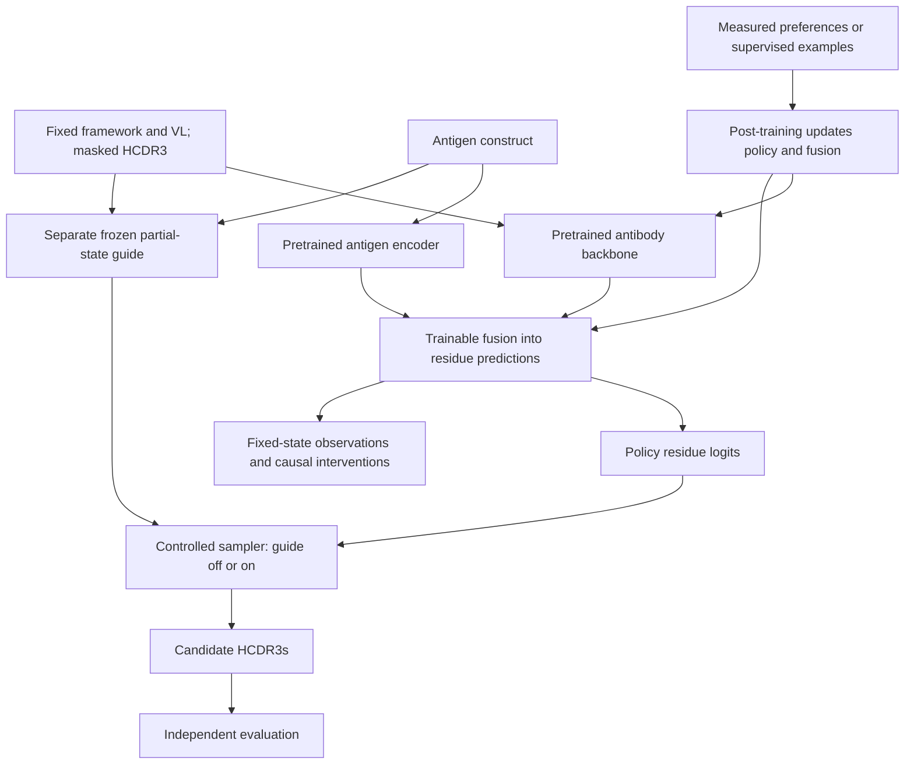

# Steerable antibody generation

## Current direction: interpreting HER2 HCDR3 post-training

The HER2 training and evaluation campaign is complete. The next build studies
how its checkpoints use residue context: native activation patching, repeat
completion, joint component ablations, and sparse circuit reconstruction checked
against interventions in the original model. All arms, including collapsed DPO
checkpoints, are eligible. Predictive improvement and a compact circuit are
research outcomes rather than prerequisites. See the
[current research scope and implementation inventory](reference/research-design.md).

The active experiment is a **fixed-scaffold HCDR3 benchmark on the
trastuzumab/HER2 affinity library**: one lineage, one target, ten editable HCDR3
positions inside a fixed heavy framework and a fixed light chain, and published
binding **bins** (`high`/`mid`/`low`) rather than KD values. The generator is the
pinned **p-IgGen** causal antibody language model, used standalone — it reads a
fixed 99-token VH prefix and predicts the ten core residues. It is **not** the
custom antigen-conditioned architecture described further down: there is no
antigen encoder, no fusion module and no guide in this line of work.

| Piece | Role |
|---|---|
| p-IgGen (pinned release, 22,097,408 parameters) | the **generator**, scored and sampled over the ten core positions |
| initial SFT | five passes over the 120,504 training high-bin cores; two arms — `sft` from the pinned weights and `scratch` from a matched random initialization — at seeds 20260918/19/20, selected by validation positive NLL |
| continued SFT | more of the *same* objective on the eligible high-bin positives: no pairs, no reference cache |
| DPO | distance-matched high-vs-low **preference pairs** against a frozen reference cache of the selected parent |
| matched budgets | measured GPU seconds per seed: 180/360/600 s for both methods, plus 1200/1800 s for DPO |
| three-class CNN and additive linear model | **auxiliary ranking comparators on measured populations only** — not the generator, not a reward model, not a preference source, not a generator selection criterion, and never applied to generated draws |
| independent SPR workbook | other people's designs, measured by someone else, with every library overlap removed |

**What this benchmark is.** A dense ten-site library, not a few wild-type
mutants: 76.5% of training cores carry **seven or more** mutations away from the
trastuzumab core and only 442 of 367,042 carry one or two. What makes held-out
ranking here interpolation is proximity to the **training set**, not to wild
type — a validation-only probe found 90.2% of held-out rows within Hamming 1 of a
training core (98.4% within 2), where a plain nearest-training-neighbour label
lookup already reaches 0.981 average precision. This contextualizes predictive
performance; it does not determine whether a checkpoint can be interpreted.
The proximity strata are reported rather than fixed.

**Results (2026-09-18).** All initial fits, six SFT/DPO continuations, 31 native
generation checks and the available final endpoints are complete. All nine
continued-SFT checkpoints pass the diversity gates; all fifteen DPO checkpoints
fail. SFT retains 97-98% unique draws, while thirty-minute DPO retains about 19%.
The frozen rule selects three-minute continued SFT in every seed. DPO improves
aggregate library AP slightly, but has lower observed affinity correlations on
the 152 quantified independent SPR designs. The planned binary SPR endpoint is
unavailable: 434 primary-cohort KD cells contain unresolved `N/A`, which is not
assumed to mean nonbinding. [Full results, uncertainty and limitations](reference/her2-posttrain.md)
include every budget, proximity stratum, baseline and numerical-evaluation amendment.
The initial integrity
audit read aggregate label counts and printed two example rows from **each split,
including test**; the split was therefore not sealed from the start.
p-IgGen's HER2 pretraining exposure is unscanned and unresolved.

**Guarded revision (2026-09-19).** All 54 trajectories and three validation-selection
stages are complete: 24 trajectories reached 600 training GPU seconds and 30
stopped on the prospective one-nat-per-sequence likelihood-drop gate. Standard
DPO stopped before 180 seconds at every tested beta. IPO with tau=0.1 had the
highest prespecified validation macro-AP at each matched budget; at 600 seconds
it reached 0.8772 versus 0.8531 for continued SFT (+2.414 percentage points), with
all three seeds passing likelihood and diversity eligibility. DPOP, additive
hinge, and DPO+NLL also supplied eligible ranking improvements at their strongest
tested likelihood coefficients. These results establish stabilization and
validation-ranking gains under the declared criteria; affinity improvement has
not been established. [Completed results, figures, and evidence](reference/her2-guarded-results.md),
[prospective protocol](specs/her2_guarded_continuation.md), and
[local dashboard instructions](scripts/her2_dashboard/README.md) are retained.

The [support-preservation audit and conditional replay plan](specs/her2_support_preservation_plan.md)
specifies the next inference-only checks, including failed checkpoints, before
any new replay experiment. It includes the Git/Windows artifact handoff.

**Running the support audit (inference only; no training, no sampling, no commits).**
The stages run in protocol order and each one refuses to start on evidence the
previous one did not produce. Scoring is gated on a *committed* specification:
`prepare` writes the tracked evidence, a human reviews and commits it, and only
then does `freeze` record the marker that `score` and `ches` require. There is no
`--allow-dirty`.

```bash
python scripts/audit_her2_support.py --help
python scripts/audit_her2_support.py inventory        # verify 159 states + 3 parent banks
python scripts/audit_her2_support.py prepare          # write reference/evidence/... (no scoring)
python scripts/audit_her2_support.py preflight        # bounded numerical probes on new code
# review and commit the generated evidence and the config, then:
python scripts/audit_her2_support.py freeze           # verifies the commit; writes the marker
python scripts/audit_her2_support.py score            # signed drops, tails, strata, pairing
python scripts/audit_her2_support.py ches             # parent CHES, displacement, increments
python scripts/audit_her2_support.py decide
python scripts/audit_her2_support.py report --publish # report + small tables + figures
python scripts/audit_her2_support.py --verify-only    # re-check completed artifacts only
```

A completed stage is **verified and reused**, not recomputed: `score` and `ches`
check their summaries and every shard against the run's completion manifest, add a
bounded parent-cache parity probe, and return. An *interrupted* stage reuses the
per-state shards that finished and computes only the rest. Completed artifacts —
shards, report, figures and the completion marker — are immutable; a rerun that
would change one fails instead of overwriting it, and `--recompute` does not
relax that. Every shard's record *and* its `.npz` are registered in the manifest,
so an output that is deleted after the fact is still reported rather than
disappearing from a directory scan.

Outputs go to the new run root `outputs/her2_support_audit_20260919_r2/` (ignored);
the tracked, portable half is `reference/evidence/her2-support-audit-2026-09-19/`
and the published narrative is `reference/her2-support-audit.md`. `--publish` also
copies the small decision/coverage/verification/checkpoint/CHES tables to
`reference/evidence/her2-support-audit-2026-09-19/published/` and the figures to
`reference/figures/her2-support-*.png`, with links relative to the published
report so they resolve in the repository. It writes local tracked files only: this
CLI performs no network or Git action, and committing them stays a human decision. Machine-local
roots — the guarded campaign directory is a junction on the recording box — live
in the ignored `local_roots.json` inside the run root, or can be passed with
`--guarded-root`, `--original-root` and `--raw-root`; no scientific field ever
carries a host path. The live dashboard gains a read-only audit panel:

```bash
python scripts/her2_live_dashboard.py --audit outputs/her2_support_audit_20260919_r2 --port 8766
```

**Rebuilding a completed audit report.** The audit's `report` stage has a known
rerun rendering defect: on a rerun `her2_support.save_figure` writes
its comparison render to `<name>.png.rerender` and calls `savefig` without
`format=`, which matplotlib cannot infer from that suffix. `her2_support.py` is a
member of the frozen `AUDIT_SOURCE_FILES`, so fixing it would change the audit's
source identity and invalidate a completed, published measurement. The defect
therefore stays, documented, and a *completed* report is verified and rebuilt
with a separate additive tool that never re-renders a figure:

```bash
python scripts/rebuild_her2_support_report.py --check-only   # verify, write nothing
python scripts/rebuild_her2_support_report.py                # verify, then record
```

It re-hashes the frozen identity, the committed inventory, the completion
manifest and every shard it binds, checks every file the publication manifest
names, reuses the verified figure bytes verbatim, re-renders both Markdown
variants through the audit's own pure `render_report` with the **original**
recorded timings, and compares them byte for byte against the run-directory and
published reports. The audit's original production of that report succeeded; what
failed was the later re-render. Only after all of that does it record an
operational "report verified" status — preserving that recorded failure beside
it, because it is evidence about the renderer — and write
`reference/evidence/her2-support-audit-2026-09-19/review/report-compatibility.json`.
It writes nothing into the audit's own completion manifest: a later tool does not
register itself in the saved authority that the completed artifacts are checked
against.

**Conditional parent-replay screen (phase D).** The audit escalated on both
intended surviving methods, so the exposure-matched screen in the plan is
warranted: two tasks (continued SFT, IPO tau=0.1) x six replay coefficients
(0, 0.01, 0.1, 1, 10, 100) x three parent seeds = **36 trajectories**, at 64
chosen examples per optimizer update, with endpoints at 64,000 / 128,000 /
240,000 chosen exposures. Fitting is gated on a *second*, separate specification
freeze, written after the audit and informed by it:

```bash
python scripts/posttrain_her2_replay.py --help
python scripts/posttrain_her2_replay.py prepare     # existing inputs + the common ordered stream
python scripts/posttrain_her2_replay.py preflight   # native parity + a synthetic gradient control
# review and commit the generated evidence and the config, then:
python scripts/posttrain_her2_replay.py freeze      # verifies the commit; writes the marker
python scripts/posttrain_her2_replay.py banks       # replay + monitoring banks and teacher caches
python scripts/posttrain_her2_replay.py fit         # the declared queue, one exclusive writer
python scripts/posttrain_her2_replay.py status
python scripts/posttrain_her2_replay.py report --publish
python scripts/posttrain_her2_replay.py verify
```

`prepare` resolves existing inputs and the ordered training stream only; the
banks are generated **after** the freeze, under the sampling rule, seeds, counts
and dtypes it binds, and their digests are bound back to it and re-hashed against
that manifest once before the first update — every array and the identity sidecar
beside it, since nothing can be loaded without one. `verify` holds the run to what
its own records claim: the reached endpoints, the journalled passing and failing
snapshots and each terminal status, so deleting an artifact does not delete its
requirement. No optimizer step touches a HER2
parent before the freeze: the preflight's real-parent half is inference only, and
its gradient half runs on randomly initialized weights of the same architecture
with synthetic inputs, at the full configured learning rate and at the production
effective batch. There is no resume — an interrupted trajectory is `incomplete`
and is never restarted under the same identity — a gate breach stops one
trajectory while the queue continues, and an unexpected exception makes that
trajectory `failed` and fail-stops the campaign. Whether a writer is alive is
decided by the exclusive OS lock, observed without taking it; a heartbeat's age is
a stall signal and never the liveness test. Outputs go to the ignored
`outputs/her2_parent_replay_20260920/`; the run root's machine-local location
lives in that directory's ignored `local_roots.json`. The dashboard gains a
read-only Replay tab:

```bash
python scripts/her2_live_dashboard.py --audit outputs/her2_support_audit_20260919_r2 \
  --replay outputs/her2_parent_replay_20260920 --port 8766
```

This screen reports the preservation-versus-ranking tradeoff. It selects no
winner, and preservation is not affinity.

**Sources**, hash-pinned and tracked: the affinity library and SPR workbook
([`specs/benchmarks/buzz_her2_affinity.json`](specs/benchmarks/buzz_her2_affinity.json),
oxpig/`Tz_her2_affinity_and_beyond`, BSD-3-Clause), the AbSci de novo HER2
release used **only** as a support-mismatch diagnostic
([`specs/benchmarks/absci_denovo_her2.json`](specs/benchmarks/absci_denovo_her2.json)
— its license requires that any reference to or publication of those data be
**attributed to Absci Corporation (2023)**), and the p-IgGen weights
([`specs/benchmarks/piggen_backbone.json`](specs/benchmarks/piggen_backbone.json)).
The assay workbook's metadata declares **SPR** on a Carterra CMDP chip while the
upstream repository README abstract says Biolayer Interferometry; the workbook is
the labelled source and is what this benchmark reports, with the discrepancy
preserved rather than resolved.

Full specification — populations, budgets, preregistered diversity gates,
selection rule and limitations — is in
[the benchmark protocol](specs/her2_hcdr3_benchmark.md). Post-training needs the
optional extra: `pip install -e ".[her2]"`.

## Previously: ESM-IF1 post-training on CR9114/H1

This line of work is **history, not the active experiment**; its artifacts and
conclusions stand as recorded. It studied ESM-IF1 post-training on the CR9114/H1
binding benchmark, with 16 binary heavy-chain sites and one fixed structural
context. The working template is 5CJQ; the benchmark sequence-to-structure mapping
is verified and the structural input is prepared. Released-model scoring checks and
a bounded supervised pilot completed; see the [pilot results](reference/cr9114-5cjq-pilot.md).
The first [direct-DPO and SFT-to-DPO pilots](reference/cr9114-dpo-pilot.md) also
completed: pair ordering improved, while SFT retained stronger top-candidate
selection on the development pool. [Follow-up diagnostics](reference/cr9114-dpo-diagnostics.md)
replicate that tradeoff on additional development variants and show substantial
DPO diversity loss. They do not rule out broader overfitting; test labels remain untouched.
An [explicit entropy-control comparison](reference/cr9114-diversity-pilot.md)
subsequently restored much of that diversity across two DPO seeds, but no setting
passed the joint affinity/diversity screen. SFT remains the selection baseline.
An [affinity-weighted likelihood comparison](reference/cr9114-affinity-pilot.md)
then retained diversity and improved top-32 affinity in both seeds, but top-16
performance did not repeat across seeds. Its two-seed screen also fails; no
checkpoint is promoted.
See the
[experiment recommendation](reference/fixed-target-posttraining-recommendation.md)
and [prepared context](reference/cr9114-5cjq-context.md).

## Broader research approach

The broader research program examines antigen conditioning, inference-time
guidance, and fixed-length HCDR3 editing. The custom-model implementation and
longer-term architecture described here support that broader direction. It is a
**different system** from the standalone p-IgGen experiment above: the HER2 work
uses a pretrained antibody LM with no antigen input, while the architecture below
fuses an antigen encoder into an antibody backbone.

The proposed architecture starts from a pretrained protein model, adapts VH/VL
behavior where needed, and fuses antigen information into residue predictions. A
separately trained, frozen property guide reweights candidate probabilities during
sampling. Post-training updates the policy and its trainable fusion components.

The generative design uses masked diffusion to complete HCDR3 from varying amounts
of observed context, with a matched partial-state baseline for comparison.
Supervised continuation provides the first weight-update baseline. Preference
methods are evaluated on pairs with the same antigen, framework, light-chain
context, and edit length, under comparable assay conditions.



The guide supplies predictions to the sampler; its hidden representations do not
enter the policy. This separates guidance during generation from changes learned
through post-training.

## Experimental design

Antigen conditioning is evaluated by holding antibody context fixed and comparing
HCDR3 predictions across antigens against held-out measurements. The experiment
uses one conditioned parent policy, a separately trained frozen guide, and the
same sampling protocol in four arms:

| Policy | Guide off | Guide on |
|---|---|---|
| Before post-training | A: conditioning baseline | B: guidance effect |
| After post-training | C: learned policy change | D: combined intervention |

The comparisons `C - A`, `B - A`, and `D - C` measure the effects of post-training
and guidance on withheld experimental outcomes. Crossing the policy's and guide's
antigen inputs independently identifies which component supplies specificity.
Sampling-plus-reranking and supervised-continuation controls use declared budgets.
Biological improvement requires independent measurements; guide scores alone
cannot establish it.

Mechanistic analysis holds corrupted antibody states, masks, positions, and time
levels fixed, then compares antigen contexts and intervenes on aligned fusion
activations before and after post-training. These interventions examine what the
policy computes at a given input. Trajectory analysis examines which inputs a
guided sampler visits. Sparse internal features are a later diagnostic option.

## Documentation

- [Current research scope](reference/research-design.md):
  implemented capabilities and the mechanistic interpretation work remaining.
- [Custom-model workflow](reference/custom-model-workflow.md):
  data preparation, training settings, checkpoint compatibility, and infill commands.
- [Decision 0003](specs/decisions/0003-pretrained-conditioned-policy.md) and the
  [conditioning specification](specs/pretrained_conditioned_policy.md):
  historical decisions and the optional antigen-conditioned extension.

## Current capabilities

The repository provides a custom antibody model, an ESM-IF1 policy integration,
and supporting tools:

| Area | Available implementation |
|---|---|
| HER2 fixed-scaffold pipeline | `smallAntibodyGen.experiments.her2_*` with `scripts/{audit,train,posttrain,evaluate}_her2.py`: provenance audit, initial SFT, GPU-budgeted DPO and continued-SFT continuations, validation freeze, one-shot evaluation |
| Data and evaluation | OAS/ASD preparation, target identity and leakage audits, frozen inputs and HCDR3 contrast scoring |
| Antibody policy | Custom antibody MLM and VH/VL refinement |
| Antigen fusion | Cross-attention into antibody residue logits; optional frozen/LoRA ESM antigen encoder |
| Sampling and guidance | Single-pass and iterative HCDR3 infill; optional external guide |
| Generative objective | MLM, partial-state masking and mask-rate schedules |
| Interpretability | Synthetic antigen-pathway probe for the custom model; native p-IgGen patching, joint ablations, and transcoder circuit tracing are planned |
| ESM-IF1 dependency layer | `smallAntibodyGen.esmif1_compat` makes the archived `fair-esm` inverse-folding stack importable on this repo's torch/numpy versions |
| ESM-IF1 editing policy | `smallAntibodyGen.models.esmif1_policy` scores and samples a fixed-geometry, two-alleles-per-site constrained edit space through the native decoder |
| ESM-IF1 structural input | `smallAntibodyGen.structure` turns a hash-pinned local PDB/mmCIF file plus an explicit residue correspondence into the policy's encoder inputs, failing closed on anything unsupported or ambiguous |

Two integration statuses that are easy to conflate. A **pretrained antibody
backbone** is in use — the pinned p-IgGen LM of the HER2 experiment above — but it
is not integrated into the antigen-conditioned architecture in this section, which
still has no pretrained antibody backbone, no controlled experiment runner and no
masked-diffusion objective. A **preference trainer** exists and is used
(`experiments.dpo` for CR9114, and the HER2 continuation stage); what is not
integrated is preference training *of the antigen-conditioned policy*. The
existing ESM option replaces only the antigen encoder.

The ESM-IF1 dependency layer is not backbone integration: it makes the upstream
package import and run, and nothing more. Install it with
`pip install -e ".[esm-if1]"` and call `esmif1_compat.install()` before the first
`esm.inverse_folding` import. The extra deliberately omits `torch-scatter`; the
module substitutes the single function ESM calls from it, avoiding a native
extension build on the Windows training box. Measured readiness — hardware budget, verified
weight loading, and the batch range beyond which throughput regresses — is recorded
in
[the training-box evidence](reference/evidence/esm-if1-training-box-2026-09-14.json).

The ESM-IF1 editing policy is decoder mechanics, not a result. It implements the
probability contract in
[the recommendation](reference/fixed-target-posttraining-recommendation.md) —
native alphabet and decoding order, immutable residues forced into every prefix
at probability one, each editable site normalized over its two alleles at
temperature 1 — as a differentiable teacher-forced score, a sampler that agrees
with it exactly, and a cached frozen-encoder geometry. It loads no weights,
declares no structure, maps no benchmark site onto a residue index, and trains
nothing; its tests run on a toy backbone plus an optional randomly initialized
upstream model that downloads nothing. Exact semantics, limitations, and the
completed integration evidence are in [the policy specification](specs/esmif1_policy.md).

The ESM-IF1 structural input layer is the declaration between a local structure
file and those coordinates. It pins the file by SHA-256, makes every choice the
parsers would otherwise make silently — author versus label numbering, which data
block, which model, which alternate location — into a declared field, and carries
an explicit residue correspondence plus the site order the policy's positional
sort would otherwise lose. Its v1 rules are restrictive on purpose: alternate
locations, missing backbone atoms, non-canonical residues and solvent sharing a
selected chain are **rejected by name rather than filtered out**. It writes a
portable artifact and a deterministic report in which every model-integration
check is recorded as NOT RUN, because it supplies no model and loads no weights.
The [CR9114/5CJQ context](reference/cr9114-5cjq-context.md) is now prepared and
source-verified: 121 decoded VH residues, 16 editable sites, partner VL, and the
antigen trimer. Missing antigen regions are explicit fragment breaks. Its adapter
unit tests use generated synthetic files; real-context scoring parity and a
256-step decoder-only pilot passed on the training GPU.
Schema, exact supported and rejected
cases, and limitations are in
[the structural-input specification](specs/esmif1_structure.md).

**Working template selected, 2026-09-16:** [5CJQ](reference/5cjq-structural-template.md)
for CR9114/H1. Source files are hash-pinned and the benchmark VH mapping is
verified and the structural input is prepared. Its engineered H1-derived stem is proxy context,
not an established match to the assayed antigen construct.

The [bounded CR9114 pilot](reference/cr9114-5cjq-pilot.md) now provides released-model
scoring checks and decoder-only supervised training. These are fixed-target
development pilots; broader benchmarks and general manifests remain incomplete.
Hardware and weight-loading readiness are recorded in the training-box evidence above. The
[completed pilot report](reference/evidence/cr9114-5cjq-pilot-2026-09-16.json)
records the first real-context scoring and training results; test data remain reserved.
The [preference-pair development evaluation](reference/cr9114-preferences-development.md)
now supplies separate training/development pairs and quantifies SFT ordering
headroom. The [DPO pilot](specs/cr9114_dpo.md) implements the objective,
checkpoint-specific reference caches, and matched direct-DPO/SFT-to-DPO runs.
[Completed run evidence](reference/evidence/cr9114-dpo-pilot-2026-09-16.json)
records both branches and their development tradeoff; this remains a single-seed pilot.
Implemented components alone do not establish biological improvement.

The [diversity-method audit](reference/cr9114-diversity-method-audit.md) distinguishes
global sampling diversity from variety among strong shortlisted candidates. A
[locked shortlist comparison](reference/cr9114-shortlist.md) improved sequence
distance but missed its affinity tolerance at 32 candidates; its selector is not
promoted. The [three-seed regularization comparison](reference/cr9114-regularization.md)
completed twelve runs under a [fixed protocol](specs/cr9114_shortlist.md), holding
affinity training constant while comparing reference KL, entropy, and embedding
diversity. No regularizer retained or improved both ordinary affinity budgets
against its direct matched control in every seed; no checkpoint was promoted.

The [completed larger-budget affinity-only diagnostic](reference/cr9114-budget-pressure.md)
extended that same seed-20260925 control to 16,384 updates and 65,536 labelled
exposures (64 times the earlier budget), with reference and diversity penalties
disabled and AdamW weight decay retained. Under the
[predeclared protocol](specs/cr9114_budget_pressure.md), exact total variation from
SFT reached 0.4678. There were still 979 unique variants in 1,024 final draws, but
development-block probability fell from 19.18% to 0.0421% and ordinary top-16
affinity fell from 9.572 to 9.498. The higher conditional development mean applies
to only 0.0313% of the final probability mass. The independent audit passed; all
reserved test measurements and the 3,046 unused eligible development measurements
remain untouched. No checkpoint was promoted.
