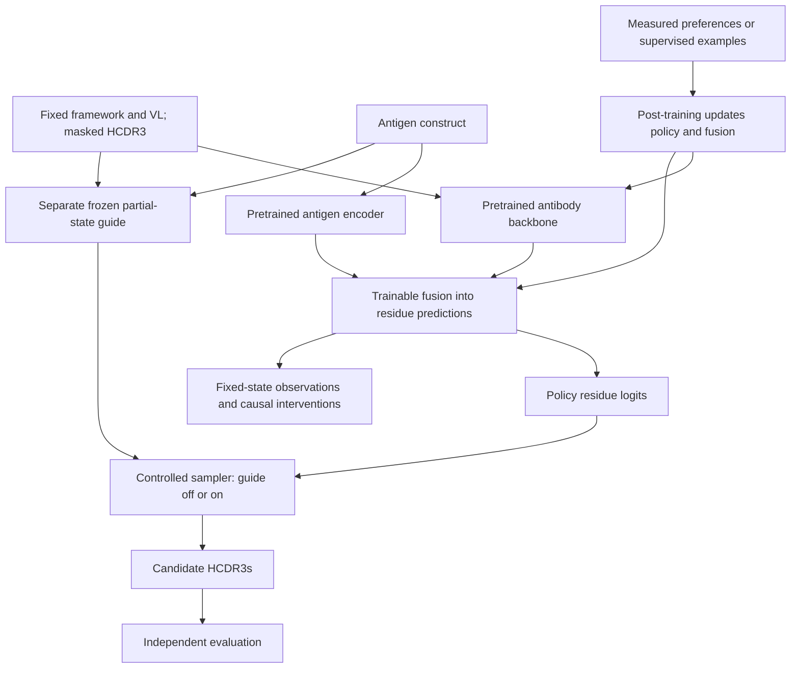

# Steerable antibody generation with pretrained antigen-conditioned policies

The current experiment studies **ESM-IF1 post-training on the CR9114/H1 binding
benchmark**, with 16 binary heavy-chain sites and one fixed structural context.
The working template is 5CJQ; the benchmark sequence-to-structure mapping is
verified and the structural input is prepared. Released-model scoring checks and
a bounded supervised pilot have completed; see the [pilot results](reference/cr9114-5cjq-pilot.md).
See the
[experiment recommendation](reference/fixed-target-posttraining-recommendation.md)
and [prepared context](reference/cr9114-5cjq-context.md).

The broader research program examines antigen conditioning, inference-time
guidance, and fixed-length HCDR3 editing. The custom-model implementation and
longer-term architecture described below support that broader direction.

## Broader research approach

The proposed architecture starts from a pretrained protein model, adapts VH/VL
behavior where needed, and fuses antigen information into residue predictions. A
separately trained, frozen property guide reweights candidate probabilities during
sampling. Post-training updates the policy and its trainable fusion components.

The generative design uses masked diffusion to complete HCDR3 from varying amounts
of observed context, with a matched partial-state baseline for comparison.
Supervised continuation provides the first weight-update baseline. Preference
methods are evaluated on pairs with the same antigen, framework, light-chain
context, and edit length, under comparable assay conditions.

The guide supplies predictions to the sampler; its hidden representations do not
enter the policy. This separates guidance during generation from changes learned
through post-training.

## Experimental design

Antigen conditioning is evaluated by holding antibody context fixed and comparing
HCDR3 predictions across antigens against held-out measurements. The experiment
uses one conditioned parent policy, a separately trained frozen guide, and the
same sampling protocol in four arms:

| Policy | Guide off | Guide on |
|---|---|---|
| Before post-training | A: conditioning baseline | B: guidance effect |
| After post-training | C: learned policy change | D: combined intervention |

The comparisons `C - A`, `B - A`, and `D - C` measure the effects of post-training
and guidance on withheld experimental outcomes. Crossing the policy's and guide's
antigen inputs independently identifies which component supplies specificity.
Sampling-plus-reranking and supervised-continuation controls use declared budgets.
Biological improvement requires independent measurements; guide scores alone
cannot establish it.

Mechanistic analysis holds corrupted antibody states, masks, positions, and time
levels fixed, then compares antigen contexts and intervenes on aligned fusion
activations before and after post-training. These interventions examine what the
policy computes at a given input. Trajectory analysis examines which inputs a
guided sampler visits. Sparse internal features are a later diagnostic option.

## Documentation

- [Research design and implementation plan](reference/research-design.md):
  experimental controls, post-training requirements, and the research roadmap.
- [Custom-model workflow](reference/custom-model-workflow.md):
  data preparation, training settings, checkpoint compatibility, and infill commands.
- [Decision 0003](specs/decisions/0003-pretrained-conditioned-policy.md) and the
  [migration specification](specs/pretrained_conditioned_policy.md):
  the accepted architecture and implementation boundaries.

## Current capabilities

The repository provides a custom antibody model, an ESM-IF1 policy integration,
and supporting tools:

| Area | Available implementation |
|---|---|
| Data and evaluation | OAS/ASD preparation, target identity and leakage audits, frozen inputs and HCDR3 contrast scoring |
| Antibody policy | Custom antibody MLM and VH/VL refinement |
| Antigen fusion | Cross-attention into antibody residue logits; optional frozen/LoRA ESM antigen encoder |
| Sampling and guidance | Single-pass and iterative HCDR3 infill; optional external guide |
| Generative objective | MLM, partial-state masking and mask-rate schedules |
| Interpretability | Synthetic antigen-pathway probe |
| ESM-IF1 dependency layer | `smallAntibodyGen.esmif1_compat` makes the archived `fair-esm` inverse-folding stack importable on this repo's torch/numpy versions |
| ESM-IF1 editing policy | `smallAntibodyGen.models.esmif1_policy` scores and samples a fixed-geometry, two-alleles-per-site constrained edit space through the native decoder |
| ESM-IF1 structural input | `smallAntibodyGen.structure` turns a hash-pinned local PDB/mmCIF file plus an explicit residue correspondence into the policy's encoder inputs, failing closed on anything unsupported or ambiguous |

The pretrained antibody backbone, controlled experiment runner, masked-diffusion
objective, and preference trainer are not yet integrated. The existing ESM option
replaces only the antigen encoder.

The ESM-IF1 dependency layer is not backbone integration: it makes the upstream
package import and run, and nothing more. Install it with
`pip install -e ".[esm-if1]"` and call `esmif1_compat.install()` before the first
`esm.inverse_folding` import. The extra deliberately omits `torch-scatter`; the
module substitutes the single function ESM calls from it, avoiding a native
extension build on the Windows training box. Measured readiness — hardware budget, verified
weight loading, and the batch range beyond which throughput regresses — is recorded
in
[the training-box evidence](reference/evidence/esm-if1-training-box-2026-09-14.json).

The ESM-IF1 editing policy is decoder mechanics, not a result. It implements the
probability contract in
[the recommendation](reference/fixed-target-posttraining-recommendation.md) —
native alphabet and decoding order, immutable residues forced into every prefix
at probability one, each editable site normalized over its two alleles at
temperature 1 — as a differentiable teacher-forced score, a sampler that agrees
with it exactly, and a cached frozen-encoder geometry. It loads no weights,
declares no structure, maps no benchmark site onto a residue index, and trains
nothing; its tests run on a toy backbone plus an optional randomly initialized
upstream model that downloads nothing. Exact semantics, limitations, and the
pending gates are in [the policy specification](specs/esmif1_policy.md).

The ESM-IF1 structural input layer is the declaration between a local structure
file and those coordinates. It pins the file by SHA-256, makes every choice the
parsers would otherwise make silently — author versus label numbering, which data
block, which model, which alternate location — into a declared field, and carries
an explicit residue correspondence plus the site order the policy's positional
sort would otherwise lose. Its v1 rules are restrictive on purpose: alternate
locations, missing backbone atoms, non-canonical residues and solvent sharing a
selected chain are **rejected by name rather than filtered out**. It writes a
portable artifact and a deterministic report in which every model-integration
check is recorded as NOT RUN, because it supplies no model and loads no weights.
The [CR9114/5CJQ context](reference/cr9114-5cjq-context.md) is now prepared and
source-verified: 121 decoded VH residues, 16 editable sites, partner VL, and the
antigen trimer. Missing antigen regions are explicit fragment breaks. Its adapter
unit tests use generated synthetic files; real-context scoring parity and a
256-step decoder-only pilot passed on the training GPU.
Schema, exact supported and rejected
cases, and limitations are in
[the structural-input specification](specs/esmif1_structure.md).

**Working template selected, 2026-09-16:** [5CJQ](reference/5cjq-structural-template.md)
for CR9114/H1. Source files are hash-pinned and the benchmark VH mapping is
verified and the structural input is prepared. Its engineered H1-derived stem is proxy context,
not an established match to the assayed antigen construct.

The [bounded CR9114 pilot](reference/cr9114-5cjq-pilot.md) now provides released-model
scoring checks and decoder-only supervised training. The full four-arm experiment
and general benchmark manifests remain incomplete. Hardware and weight-loading
readiness are recorded in the training-box evidence above. The
[completed pilot report](reference/evidence/cr9114-5cjq-pilot-2026-09-16.json)
records the first real-context scoring and training results; test data remain reserved.
Implemented components alone do not establish biological improvement.
