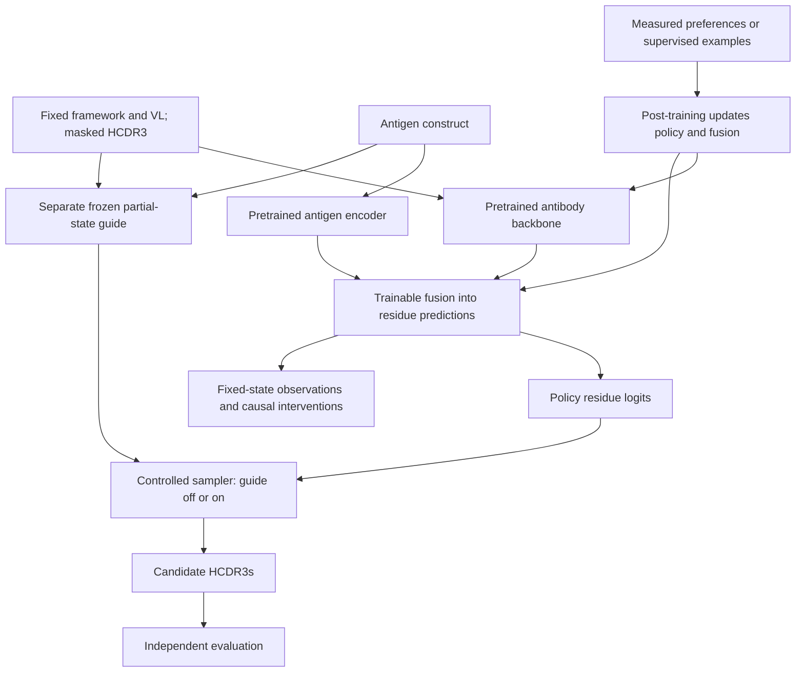

# Steerable antibody generation with pretrained antigen-conditioned policies

This project studies how antigen information changes antibody generation, how
post-training changes that behavior, and how an external property guide interacts
with the resulting policy. The initial task is **fixed-length HCDR3 editing with
the heavy-chain framework and light-chain context held fixed**.

**Plan (2026-09-09):** start with a pretrained protein model, adapt VH/VL behavior
where needed, and add antigen information to residue prediction. Pretrained
initialization lets the project focus on antibody adaptation, antigen conditioning,
and steering. VH/VL understanding and antigen-specific design still require
explicit data and held-out tests. Antibody pretraining from scratch is an optional
research control.

**First milestone:** with antibody context fixed, changing the antigen changes
HCDR3 predictions in agreement with held-out measurements. This evidence is needed
before making post-training or interpretability claims. A joint embedding or a
better compatibility classifier alone does not show that the policy uses the
antigen. A response to an unmeasured antigen swap is also insufficient for this
milestone.

The pretrained antibody policy is not yet integrated.
[Decision 0003](specs/decisions/0003-pretrained-conditioned-policy.md) records the
accepted plan; the [migration specification](specs/pretrained_conditioned_policy.md)
defines code boundaries, work order, and completion criteria.

## Current implementation

| Capability | Implemented | Planned |
|---|---|---|
| Data and evaluation | OAS/ASD preparation, target identity and leakage audits, frozen inputs and HCDR3 contrast scoring | A verified antigen-variant pilot with measurements and sealed evaluation labels |
| Antibody policy | Custom antibody MLM and VH/VL refinement | Pretrained antibody backbone, native tokenizer/head, loading and provenance |
| Antigen fusion | Cross-attention into antibody residue logits; optional frozen/LoRA ESM antigen encoder | Adaptation and measurement-based conditioning criteria for the pretrained policy |
| Sampling and guidance | Single-pass and iterative HCDR3 infill; optional external guide | Same sampler with guidance off/on, independent antigen inputs, replayable traces |
| Generative objective | MLM, partial-state masking and mask-rate schedules | Specified masked-diffusion objective and compatible sampler |
| Post-training | No preference trainer | Supervised baseline, then a tested diffusion preference estimator |
| Interpretability | Synthetic antigen-pathway probe | Fixed-state activation capture and causal fusion interventions; SAEs later |

The existing ESM option replaces only the antigen encoder; the antibody backbone
remains custom. Implemented capabilities do not establish that a trained checkpoint
meets the scientific criteria.

**Current readiness:** this checkout has no antibody-antigen corpus. The three
benchmark manifests contain owner placeholders and empty file lists, and the
training GPU/VRAM has not been recorded. Current M01 work includes acquiring and
documenting data, measuring training hardware, and preparing interfaces. Run
`nvidia-smi --query-gpu=name,memory.total --format=csv` on the training machine.
Neither the local CPU Mac nor the earlier 4 GB planning assumption is sufficient
to select a backbone. M03 conditional training requires M01's verified data and
hardware evidence; a working adapter alone is insufficient.

## Research roadmap

1. **Finalize one conditional pilot and integrate one pretrained backbone.** Fix the
   weights/revision, tokenizer, objective, usage terms, biological cases, and actual
   compute budget. DPLM and ESM-family models, including VESM, are candidates; none
   has been selected. Preserve upstream residue predictions before adding fusion.
2. **Adapt pairing and antigen conditioning.** Train the model to use antigen
   information in residue prediction and address measured VH/VL deficits while
   preserving earlier capabilities. With guidance off, evaluate the correct
   antigen, matched substitutions, and measured antigen variants, including a
   fully masked HCDR3.
3. **Specify the generative process.** Continue a conditioned MLM under a specified
   masked-diffusion objective, or adapt a diffusion checkpoint under its native
   objective. Masked diffusion supports completion of an editable region from
   varying amounts of observed context, with a specified stochastic process.
   Evaluate it against a matched partial-state control and recheck conditioning.
   Diffusion is not required for all valid post-training methods.
4. **Establish guidance and causal baselines.** Validate a separate guide on the
   partial states it will encounter. Capture fixed-state activations before
   post-training and intervene on the antigen-to-residue pathway.
5. **Compare post-training and guidance.** Start with supervised continuation,
   then evaluate a specified preference method on trustworthy pairs. Compare the
   policy before and after post-training with guidance off/on, and repeat the
   causal probes.

For a pretrained diffusion backbone, specify the generative process before
conditional training. A second round of general-protein pretraining is not
required. SAEs, variable-length design, structure co-design, and broad optimizer
sweeps follow evidence from the initial experiment.

The longer-term aim is interpretable antibody design: understand what the model
has learned, validate antigen conditioning against independent measurements, use
validated signals to steer generation through sampling and weight updates, and
test whether sparse internal features add useful diagnostics. Architecture,
supervision, splits, and representations may change as data and experiments develop.

## Planned architecture

The current custom model provides reusable fusion and infilling components. The
pretrained antibody path and experiment runner still need implementation.



The guide supplies predictions to the sampler; its hidden representations do not
enter the policy. Post-training and causal interventions are separate experiments
on the policy. SAE discovery is a later diagnostic option.

## Steering and interpretation

| Intervention | What changes | Evidence needed |
|---|---|---|
| Antigen conditioning | The policy's predictions at a fixed antibody state | Measured antigen response beyond identity and study shortcuts |
| Inference-time guidance | The sampling distribution using a separate predictor | Improvement under a controlled sampler and independent evaluation |
| Post-training | Policy parameters, including any trainable fusion | Gains with guidance off, preserving conditioning and earlier capabilities |
| Causal interpretation | Selected activations or antigen access during a diagnostic | Controlled transfer or ablation of a reproducible policy response |

Guidance reweights candidate probabilities. Finite multiplicative weights leave
zero probabilities at zero, but can amplify small nonzero probabilities if the
guide favors them enough. The reachability probe measures these limits for a
specified state, guide, and scoring rule. Its results do not apply to every
possible generation path.

With fixed inputs and deterministic evaluation, an external guide leaves a frozen
policy's forward activations unchanged. It changes sampled residues and therefore
later inputs and activations. Fixed-state interventions examine what the policy
computes at a given input; trajectory analysis examines which inputs the sampler
visits. Free-running trajectories alone cannot show that the policy learned the
guide's representation.

## Main experiment

Use one conditioned parent policy, a separately trained frozen guide, and the same
sampling protocol in all four arms:

| Policy | Guide off | Guide on |
|---|---|---|
| Before post-training | A: conditioning baseline | B: guidance effect |
| After post-training | C: learned policy change | D: combined intervention |

Measure `C - A`, `B - A`, and `D - C` on withheld experimental outcomes. Vary and
cross the policy's and guide's antigen inputs independently to identify which
component supplies specificity. Include sampling-plus-reranking and
supervised-continuation controls with declared budgets. Generated candidates
require measurements before they can be called experimentally validated
improvements.

For mechanistic analysis, fix corrupted antibody states, masks, positions, and time
levels. Compare antigen contexts and intervene on aligned fusion activations within
each checkpoint, before and after post-training. Probe accuracy, attention maps,
and better guide scores alone cannot establish causal antigen use or improved
binding.

## Post-training requirements

**Status: planned, not implemented.** The policy, external guide, frozen preference
reference, and final evaluator have distinct roles. Preferred and dispreferred
examples must share antigen, framework, light-chain context, and edit length, with
comparable assay conditions. Uncertainty and censoring must permit an ordering.

Before implementing diffusion-DPO training, `specs/masked_diffusion.md` and
`specs/diffusion_dpo.md` must define the process, estimator, policy/reference
corruption reuse, winner/loser coupling, weighting/reduction, sampling budget,
reference behavior, and enumerable toy tests. Neither document exists yet, and the
migration specification does not replace them. The post-training objective and
probability estimator must be consistent with the generative process;
`specs/diffusion_dpo.md` will be the authority for the planned estimator.

MLM pseudo-likelihood, fully masked marginal scores, trajectory log probabilities,
and the evaluation-time order-mixture `E-hat` are distinct quantities. Using them
in DPO does not make them exact diffusion sequence log probabilities. `E-hat` is an
evaluation score, not an approved preference objective. Distinguish the
variational-surrogate gap from the bias caused by noisy estimates inside a
nonlinear preference loss. See
[diffusion and post-training boundaries](specs/pretrained_conditioned_policy.md#diffusion-and-post-training-boundaries).

Supervised continuation on measured desirable examples is the first weight-update
baseline. DPO/VRPO is a candidate when trustworthy pairs exist. GRPO and iterative
preference loops also require reliable evaluation of new candidates and estimators
compatible with the sampler. The guide's scores cannot both define success and
demonstrate biological improvement from optimizing against that guide.

## Existing custom-model workflow

The commands, settings, and examples below use the custom model and support
controls and reproduction. The pretrained plan does not require completing the
OAS → paired → antigen → infill checkpoint chain. J11/J24 specifications retain
their original experiment scope.

### Checkpoint compatibility

Resuming requires the same architecture, effective configuration, tokenizer, and
data. Source and contract edits change the full provenance hash and produce a
warning without blocking resume. Schema-1 fingerprints are supported: the
compatibility hash is derived from their recorded components. Checkpoints without
fingerprints cannot be resumed.

When provenance changes, subsequent checkpoints and `run_fingerprint.json` retain
earlier fingerprints and checkpoint epochs in `resume_history`. A refused resume
preserves the previous configuration and provenance sidecars. Warm-start checks
and the explicit `--require-clean-worktree` requirement are unchanged. A successful
state restoration does not establish scientific equivalence after changes to the
loss or evaluation implementation.

### Data pipeline

- `scripts/prepare_oas.py` cleans raw OAS data into antibody-only or paired
  heavy/light JSONL files.

- `scripts/prepare_antibody_antigen.py` cleans ASD parquet shards into
  antibody-antigen JSONL files. It retains heavy/light and antigen context,
  preserves nested numbering metadata, computes HCDR3 spans when possible, and
  assigns leakage-aware splits.

  KD values can be molar (`1e-9`) or nanomolar (`1.0`); units are inferred per row
  from magnitude. Use `--strict-units` for each new ASD export to make suspected
  unit mislabels an error. Otherwise, misread units produce a warning and yield
  zero strong binders, leaving HCDR3 infill training with an empty population
  and no further error.

- `scripts/mlm_train.py` trains the antibody MLM, paired VH/VL refinement,
  antigen-conditioned compatibility refinement (synthetic-negative and real-label),
  and fixed-length antigen-conditioned HCDR3 infill.

- `scripts/hcdr3_infill.py` generates fixed-length or empirical-length HCDR3
  candidates from a trained antigen-conditioned infill checkpoint, with optional
  compatibility scoring.

### Training options

`scripts/mlm_train.py` shares these options across stages. They are opt-in and
default to historical behavior, leaving existing configs byte-for-byte unchanged
unless set. Each has a CLI flag that overrides the config value.

#### Optimization and checkpoints

- **LR schedule:** `lr_schedule: constant` (default) keeps the learning rate flat
  after warmup. `lr_schedule: cosine` decays from the peak to
  `min_lr_ratio × peak` (default `0.0`) over the rest of the run after
  `warmup_steps`. Flags: `--lr-schedule`, `--min-lr-ratio`.
- **Early stopping:** `early_stopping_patience: N` (default `0` = off) stops when
  validation loss has not improved for `N` consecutive epochs;
  `early_stopping_min_delta` (default `0.0`) is the minimum improvement that
  counts. `best.pt` retains the checkpoint with the best validation loss, allowing
  a high `epochs` limit with automatic stopping. Flags:
  `--early-stopping-patience`, `--early-stopping-min-delta`.
- **Intra-epoch checkpointing:** `checkpoint_every_steps: N` (default `0` = off)
  rewrites `last.pt` every `N` batches. After a crash, resume restarts the interrupted
  epoch from its first batch using the saved weights, retaining weight progress.
  Writes are atomic (temporary file + `os.replace`), so a crash during a write
  cannot corrupt `last.pt`. Flag:
  `--checkpoint-every-steps`.
- **TensorBoard:** `tensorboard: true` (default `false`) logs train/val loss, val
  MLM accuracy, and LR to `<output_dir>/tb`. Needs the optional `tb` extra:

  ```bash
  pip install -e ".[tb]"
  python scripts/mlm_train.py --config <config>.yaml   # config sets tensorboard: true
  tensorboard --logdir checkpoints                      # overlays all stages' runs
  ```

  Flag: `--tensorboard`.
- **New-module LR:** `new_module_lr_multiplier` (default `1.0`) gives modules left
  randomly initialized by antigen warm-start (cross-attention, fusion norms,
  `fusion_mlp`, `compatibility_head`) a separate learning rate while they adapt to
  the warm-started trunk. `1.0` preserves the historical two-group optimizer. Flag:
  `--new-module-lr-multiplier`.
- **Checkpoint selection metric:** `best_checkpoint_metric: val_loss` (default)
  or `val_compat_loss`. In antigen stages, MLM loss dominates the combined loss,
  which can improve while the compatibility head used for scoring and guidance
  gets worse. This option selects the metric for `best.pt`, early stopping, and
  the checkpoint's tracked `val_loss`, keeping resume consistent. Flag:
  `--best-checkpoint-metric`.

#### Model settings

- **Norm placement:** `norm_first: true` (default) uses pre-LN,
  `x + sublayer(LayerNorm(x))`. Its unnormalized identity path lets gradients reach
  early layers without rescaling at each depth. `norm_first: false` uses post-LN,
  `LayerNorm(x + sublayer(x))`, the original Transformer arrangement and PyTorch
  default. The setting applies to both encoder stacks and cross-attention fusion.
  Set it at the top level or in `model:`.
  Flags: `--norm-first`, `--no-norm-first`.

  Pre-LN matches every checked-in config. The former `false` default silently
  selected post-LN for hand-written configs that omitted the key.

  Changing norm placement requires retraining the whole chain from scratch.
  Pre-LN and post-LN have identical parameter names and shapes in the single-stream
  model, so `strict=True` accepts either checkpoint despite different computation.
  The init-compat check in `scripts/mlm_train.py` rejects the mismatch, including
  warm-starting a pre-LN stage from a post-LN checkpoint. Missing `norm_first`
  means post-LN, as in all checkpoints predating this option.
- **Compatibility readout:** `compat_readout: cls` (default) uses CLS-concat,
  reducing both fused streams to their index-0 summaries before `fusion_mlp`.
  `compat_readout: mean` uses mask-aware mean pooling over each stream's non-pad
  positions. CLS-concat responds weakly to single-residue substitutions, and its
  logit supplies the guidance signal. Both modes have the same parameters, so the
  init-compat check validates `compat_readout`, as it does `norm_first`.
  Flag: `--compat-readout {cls,mean}`.
- **Weight initialization:** `initializer_range: 0.02` (default) applies
  `N(0, 0.02)` to every embedding table, `Linear` weight, and cross-attention
  projection, zeroes biases, sets `LayerNorm` to `(1, 0)`, and re-zeroes
  `padding_idx` rows. `scale_residual_init: true` (default) additionally scales the
  residual-branch output projections (`attn.out_proj`, `ffn.linear2`) by
  `1/sqrt(2 * n_layers)`.

  Previously, PyTorch defaults initialized `nn.Embedding` at `N(0, 1)`. With
  `tie_weights: true`, that table also served as the output projection: a fresh
  `d_model: 256` model had logit standard deviation ~29 and MLM loss ~149 nats on
  the real OAS corpus, against an ideal `ln(vocab) ≈ 3.56`. Early training shrank
  the embedding norm while `grad_clip_norm: 1.0` clipped the gradients needed to
  do so. A fresh model now starts at ~3.5.

  Initialization affects only training from scratch. Parameter names, shapes, and
  the forward computation are unchanged; loaded weights replace the initial
  weights, so existing checkpoints still support warm-start and resume. This
  setting is therefore excluded from init-compat checks.

#### Losses and masking

- **Loss weights:** `mlm_loss_weight` (default `1.0`) scales the MLM term in the
  antigen stages; `0.0` trains on compatibility loss alone. The reported `mlm_loss`
  stays unweighted so curves remain comparable. Flag:
  `--mlm-loss-weight`.
- **Masking-rate schedule:** `mask_rate_schedule: fixed` (default) uses
  `mask_probability` for each row's target budget, with no extra collator RNG
  draws, preserving byte-identical runs. `uniform` draws a per-row rate
  `t ~ U(0, 1]` and ignores `mask_probability`, training across varying amounts of
  missing context. It does not implement a diffusion loss or reverse process and
  has no effect in `full_span` HCDR3 mode.
  `eval_mask_rate_schedule` (default `""` = inherit) sets the evaluation schedule
  independently, allowing runs with different training schedules to share an
  evaluation protocol. `report_masked_fraction_bins: true` (default `false`)
  reports per-epoch MLM accuracy by each row's actual masked fraction
  (`mlm_acc_frac_0_20` … `mlm_acc_frac_80_100`, plus token counts). Flags:
  `--mask-rate-schedule`, `--eval-mask-rate-schedule`,
  `--report-masked-fraction-bins` / `--no-report-masked-fraction-bins`.
- **Graded-affinity supervision (experimental):** `strength_loss_weight`
  (default `0.0`) adds a scalar regression head on the joint representation,
  trained against per-`(dataset, affinity_type)` strength quantiles produced by
  `scripts/annotate_affinity_targets.py`. Weight `0.0` creates no head and uses no
  extra initialization RNG draws, preserving byte-identical runs.
  `include_strength_rows` (default `false`) separately widens the stage-3 row
  filter to admit rows with a quantile but no binary label. Changing both settings
  at once confounds the graded head's effect with the effect of a larger training
  population. Reports a pooled tie-aware `val_strength_spearman`. Flags:
  `--strength-loss-weight`,
  `--include-strength-rows` / `--no-include-strength-rows`.

  ```bash
  python scripts/annotate_affinity_targets.py \
    --input  data/processed/antibody_antigen/antibody_antigen.jsonl.gz \
    --output data/processed/antibody_antigen/antibody_antigen_quantiled.jsonl.gz
  ```

  The annotator fits CDFs on the train split only. It negates scores where lower
  means stronger (raw KD), so `1.0` is always strongest, and uses mid-ranks for
  ties. It excludes groups with fewer than `--min-group-size` training rows and
  refuses to write in place. Removing the added key reproduces the input
  byte-for-byte.
- **Learned length posterior (experimental):** `length_loss_weight` (default
  `0.0`) adds a categorical head over `1..length_head_max` predicting the HCDR3
  length from `(scaffold, antigen)`. It is queried in a separate forward pass on a
  collapsed-span encoding, with the entire HCDR3 replaced by one `[MASK]`. The
  ordinary encoding reveals the length through its mask count. Out-of-range
  lengths are masked out without clamping. Reports `length_acc` and `length_nll`.
  Flags: `--length-loss-weight`,
  `--length-head-max`.

  Use the length census to choose `length_head_max`:

  ```bash
  python scripts/length_census.py \
    --data-path data/processed/antibody_antigen/antibody_antigen.jsonl.gz
  ```

  It reports length distributions per split and for the strong-binder population
  used in infill training, plus the fraction of rows each candidate
  `length_head_max` would exclude.

### Antigen-conditioned HCDR3 infilling

The custom model implements fixed-length, antigen-conditioned HCDR3 infilling
using separate antibody and antigen streams.

#### Training stage: `antigen_hcdr3_infill_refine`

- Fine-tunes the dual-stream model on strong-binder rows selected by
  `is_strong_binder`. This includes explicit boolean positives and KD / -log KD /
  fuzzy strong binders. Filtering on `binder_label == 1`, set only for
  `affinity_type == "bool"` rows, would exclude most strong binders. The broader
  flag keeps the training population representative of observed binders.
- Keeps the antibody framework, optional light chain, and antigen visible.
- Masks the entire known heavy-chain CDR3 span (`hcdr3_mask_mode=full_span`,
  `mask_replacement_strategy=always_mask`) and trains the MLM head to reconstruct
  those residues.
- Sets compatibility loss to `0.0` to train residue infilling for strong binders.
  Binder-vs-non-binder classification remains a separate scoring step.
- Supports heavy-only / nanobody records, using their heavy-chain token (`[IGH]`)
  in both training and generation to keep the masked-input distributions aligned.
- Reports HCDR3-specific metrics: token accuracy, full-span exact match,
  target-token count, and valid-span count.

The number of `[MASK]` tokens specifies the HCDR3 length. For unknown-length
design, propose lengths first, then use the same infiller for each length.

#### Generation components (`src/smallAntibodyGen/infill/hcdr3.py`)

- `FixedLengthHCDR3Infiller` builds the masked antibody/antigen input once and
  samples HCDR3 residues from the shared MLM logits (one forward per record,
  regardless of the number of samples).
- `LengthProposalStrategy` defines the interface for length predictors.
- `EmpiricalHCDR3LengthPrior` samples lengths from the same `is_strong_binder`
  population used in infill training.
- `AntigenCompatibilityScorer` ranks generated candidates with the real-label
  compatibility head.
- `guided_infill` is the opt-in, ProteinGuide-style guided sampler (see
  [Guided generation](#guided-generation-proteinguide-style-opt-in)):
  iterative easy-first unmasking that steers each residue toward the binder
  class. The single-pass `infill` remains the default.

#### Running infill refinement

```bash
python scripts/mlm_train.py --config configs/refine_antigen_hcdr3_infill.yaml
```

#### Antigen encoder: from-scratch or pretrained ESM-2 (hybrid)

`antigen_encoder_type` selects the antigen encoder:

- `scratch` (default): the repository's transformer, trained from scratch, with no
  extra dependencies.
- `esm`: a pretrained ESM-2 encoder projected to the model width (Direction 1:
  hybrid antigen encoder). Requires the optional `esm` extra. The antibody stream,
  cross-attention fusion, and heads are unchanged.

```bash
pip install -e ".[esm]"    # transformers + peft; ESM-2 8M weights download on first use
python scripts/mlm_train.py --config configs/refine_antigen_hcdr3_infill_esm.yaml
```

The ESM config warm-starts the antibody encoder, fusion, and heads from the
real-label checkpoint while retaining pretrained ESM backbone weights.
`finetune: frozen` trains only the projection/fusion/heads; `finetune: lora` adds
LoRA adapters to ESM. Before adopting it, compare HCDR3 metrics and compatibility
AUROC with the scratch baseline (`refine_antigen_hcdr3_infill.yaml`) on the same
split. See `docs/antigen-encoder-hybrid-implementation.md` for implementation
details and rationale.

#### Unknown-length design

`--length-mode` selects how many `[MASK]` tokens to place:

- `fixed` (default): use the record's known HCDR3 length.
- `empirical`: sample from a context-free histogram of training-set HCDR3
  lengths (`EmpiricalHCDR3LengthPrior`, fitted on the strong-binder population).
- `learned`: sample from the model's conditional posterior
  `p(L | scaffold, antigen)` via `LearnedLengthProposal`. This requires a
  checkpoint trained with `length_loss_weight > 0`. The checkpoint's
  `length_head_max` sets the limit; requesting a larger value fails at construction.
  The posterior is restricted to lengths whose masked encoding fits `max_length`,
  then renormalized. `--learned-length-mode top_k` makes length selection
  deterministic.

#### Generating candidates

Use each target record's known HCDR3 length:

```bash
python scripts/hcdr3_infill.py \
  --checkpoint checkpoints/mlm_antigen_hcdr3_infill_v3/best.pt \
  --data-path data/processed/antibody_antigen/antibody_antigen.jsonl.gz \
  --split val \
  --num-records 20 \
  --num-samples 16 \
  --length-mode fixed \
  --score-checkpoint checkpoints/mlm_antigen_real_label_v3/best.pt \
  --output-path outputs/hcdr3_fixed_candidates.jsonl
```

Or sample lengths from the strong-binder training distribution and infill each:

```bash
python scripts/hcdr3_infill.py \
  --checkpoint checkpoints/mlm_antigen_hcdr3_infill_v3/best.pt \
  --data-path data/processed/antibody_antigen/antibody_antigen.jsonl.gz \
  --split val \
  --num-records 20 \
  --num-samples 16 \
  --length-mode empirical \
  --score-checkpoint checkpoints/mlm_antigen_real_label_v3/best.pt \
  --output-path outputs/hcdr3_empirical_length_candidates.jsonl
```

Each JSONL row includes record identity, target metadata, the true HCDR3 (if
known), proposed length, generated HCDR3, generated heavy-chain sequence, MLM log
probability, length-normalized mean log probability, optional compatibility
score, and guidance provenance (`guidance_strength`, `guidance_order`). The raw sum
depends on length. `mean_log_probability` is a per-residue ranking heuristic for
comparing proposed lengths, not a normalized length probability.

#### Guided generation (ProteinGuide-style, opt-in)

`guided_infill` uses the binder signal during sampling without updating model
weights. It follows ProteinGuide (Xiong et al., 2025,
[arXiv:2505.04823](https://arxiv.org/abs/2505.04823)), which connects masking-based
generative formulations and supports property guidance with fixed generator
weights. This implementation enumerates candidate residues using the local scoring
rule below. It does not establish that an existing MLM checkpoint/sampler is a
trained diffusion model or that the guide is biologically calibrated. See
[Steering and interpretation](#steering-and-interpretation) and
[Post-training requirements](#post-training-requirements) for the distinction
between sampling changes and weight updates.

Guided generation fills HCDR3 iteratively, one position per step:

1. Choose the next position. The default, `confidence`, selects the lowest-entropy
   remaining position (MaskGIT-style easy-first decoding).
2. Reweight that position's residue distribution by the binder signal. For each
   canonical residue `a`,

   ```
   score(a) = log p_MLM(a | x) + gamma * log p(binder | x with this position = a)
   ```

   Exact enumeration computes the binder term in one batched forward pass over
   all ~20 candidate residues. The small amino-acid vocabulary makes this tractable.
3. Sample the residue, commit it, and repeat so later positions condition on it.

`--guidance-strength` sets `gamma`: `0` disables guidance and selects the default
single-pass `infill`; larger values increase guidance. `--guidance-order` accepts
`confidence`, `random`, or `left_to_right`.

The CLI switches from single-pass to iterative decoding when guidance becomes
positive. To isolate the effect of guidance, use the same iterative sampler in
both arms, with `guided_infill(..., guidance_strength=0)` as the unguided control.
The experiment runner described in the migration specification is not yet
implemented.

```bash
python scripts/hcdr3_infill.py \
  --checkpoint checkpoints/mlm_antigen_hcdr3_infill_v3/best.pt \
  --data-path data/processed/antibody_antigen/antibody_antigen.jsonl.gz \
  --split val \
  --num-records 20 \
  --num-samples 16 \
  --length-mode fixed \
  --guidance-strength 5.0 \
  --guidance-order confidence \
  --output-path outputs/hcdr3_guided_candidates.jsonl
```

Guidance settings and evaluation:

- **Default guide:** the generation model's compatibility head supplies the binder
  term. `--score-checkpoint` only adds a post-hoc compatibility score to the output
  and does not affect sampling.
- **External guide:** `--guidance-checkpoint` supplies the binder term from a
  separate classifier, allowing different heads for guidance and scoring. Position
  selection and reported unguided marginals still come from the generation model.
  It requires `--guidance-strength > 0`, since no classifier is used at γ = 0.
  Each output row records `guidance_checkpoint` for provenance.
- **Intermediate states:** the compatibility head is trained on fully
  HCDR3-masked inputs but queried on partially filled states during guidance. The
  signal is noisiest at early steps. `hcdr3_mask_mode: partial_span` trains on a
  uniformly random `k`-subset of the span (`k ~ U{0..L}`), covering the states
  visited during decoding, including fully visible and fully masked inputs.
  `--guidance-checkpoint` also allows a separately trained classifier.
- **Reachability:** before sweeping γ, measure whether it can change a decision:

  ```bash
  python scripts/probe_steering_reachability.py \
    --checkpoint checkpoints/mlm_antigen_hcdr3_infill_v3/best.pt \
    --data-path data/processed/antibody_antigen/antibody_antigen.jsonl.gz \
    --split val --num-records 20
  ```

  In `guided = unguided + γ · binder`, the unguided and binder terms depend on the
  state, not γ. Two forward passes therefore give the exact guided distribution
  for every γ on a grid. The probe reports flip fraction, total variation, and
  binder-term spread to measure γ's limits at that fixed context. During a full
  run, committed residues also depend on γ, so the probe does not predict a full
  sweep's generations.
- **Score reporting:** `log_probability` / `mean_log_probability` always use the
  model's unguided marginals, so guidance does not inflate the reported likelihood.
  `infill` sums independent per-position marginals from one fully masked forward
  pass; `guided_infill` sums unguided conditionals along its unmasking path. These
  scores differ even at γ = 0 and cannot be pooled into one ranking.
- **Ranking across samplers:** `smallAntibodyGen.infill.evidence` computes
  `E-hat`, the order-averaged path log-likelihood over `K` random unmasking orders.
  It is sampler-independent by construction and reports a Monte-Carlo standard
  error; a ranking gap smaller than that error is not meaningful.
  `scripts/score_candidates.py` adds `E-hat` and a weighted decision score:

  ```bash
  python scripts/score_candidates.py \
    --candidates outputs/hcdr3_guided_candidates.jsonl \
    --checkpoint checkpoints/mlm_antigen_hcdr3_infill_v3/best.pt \
    --data-path data/processed/antibody_antigen/antibody_antigen.jsonl.gz \
    --split val --num-orders 8 --w-match 1.0 --w-evidence 0.5 \
    --output outputs/hcdr3_candidates_scored.jsonl --report-demotion 5
  ```

  Weights are required because no calibrated defaults exist. Rows without a
  compatibility score receive `decision_score: null` and
  `decision_score_omitted: ["compatibility"]`. `--report-demotion k` measures how
  evidence-based ranking, which rewards typicality, can demote the unusual
  candidates sought through steering.

### Leakage-aware splitting

Random row splits can place examples from the same target, study, or antibody
family in both training and validation. This can overestimate antigen-conditioned
generalization by measuring memorization of repeated biological problems or
source conventions.

ASD preprocessing reduces this risk by assigning splits using target identifiers
in priority order: UniProt, PDB, normalized target name, then an antigen-sequence
hash. This improves on random row splitting but has limitations.

#### Typed target identity (`smallAntibodyGen.target_identity`)

The priority chain treats all identifiers as equally strong identity evidence.
A shared PDB entry can merge different genes because it contains several polymer
chains; a normalized name can merge non-homologous constructs.
`smallAntibodyGen/target_identity.py` is an opt-in replacement accessed through
`scripts/resolve_target_identity.py`. It leaves the producer unchanged and
distinguishes three relations that must not be collapsed into one graph:

| Relation | Question | Evidence |
|---|---|---|
| `construct_id` | Are these the same construct? | Near-exact sequence identity with near-full reciprocal coverage |
| `biological_target_id` | Are these the same target? | Shared accession, an approved name, or family-level similarity |
| `quarantine_partners` | Must these stay in the same split? | Local containment, a shared structure entry, an unapproved name |

Containment is asymmetric; identity is symmetric. A sequence contained in another
can require quarantine without implying identity. Sharing a structure entry is
evidence of leakage only. Curator names should be retained, merging coherent sets
of constructs and quarantining incoherent sets.

Complete-linkage clustering bounds cluster diameter by the similarity threshold.
Connected components would allow longer chains. Each cluster reports its minimum
pairwise identity and coverage. Candidate generation is required for correctness:
both filters are derived necessary conditions, and recall is checked against
exhaustive all-pairs alignment.

```bash
# Run the engine over the raw shards and emit the Level-1 evidence artifacts:
# claim manifest, split manifest, guard report, leakage line, conformance attestation.
python scripts/resolve_target_identity.py --name asd-typed-v1
```

The command leaves the shipped data unchanged and writes no corpus. Every number
reported for a split includes a standard leakage line stating the claim, assessed
and unassessed relations, conditioning universe, and population. This makes holdout
limits explicit: this corpus groups by antigen and does not hold out antibodies.

#### Paired OAS: split key and length budget

Two corpus defects were fixed in `scripts/prepare_oas.py`. Both require regenerating
the paired corpus; existing `oas_paired.jsonl.gz` files retain the defects.

**Split key.** Paired splits now use the heavy chain. Previously, they used the
full `(heavy, light)` pair, allowing a heavy chain with several cognate light
chains to appear in both splits. In the shipped corpus, 1,406 heavy sequences
appeared in both, and 6.3% of validation rows had a byte-identical heavy chain in
training. Stage-2 validation loss, which selects `best.pt`, therefore partly
measured memorization of the HCDR3 target. The unpaired path already keyed on
`f"{locus}:{variable_aa}"`; the paired path now follows that approach. Deduplication
still uses the full `(heavy, light)` pair, since each distinct pair is a distinct
example.

**Length budget.** `max_length` silently truncates nearly the entire paired corpus.
`prepare_oas.py` bounds heavy and light lengths independently (`--max-heavy` 180 +
`--max-light` 160 + 5 special tokens = up to 345 tokens) and writes `token_length`
without clamping it to an encoder budget. At the shipped `max_length: 192`:

| Measure | Paired corpus |
|---|---|
| Rows | 306,760 |
| Exceed `max_length=192` | 306,666 (99.97%) |
| Lose the entire light CDR3 | 306,057 (99.77%) |

The paired stage learns heavy/light compatibility, which depends most on CDR-L3.
The shuffled-negative task therefore compared cognate and non-cognate light chains
with CDR-L3 removed from both. Python's deduplication of the tokenizer's truncation
`UserWarning` hid the extent of the problem.

At startup, `scripts/mlm_train.py` now reports overflow counts and lost heavy/light
CDR3 spans for each split. It warns without blocking training, leaving the remedy
to the researcher:

- Raise `max_length`, requiring retraining and more compute per step because
  attention is quadratic.
- Tighten `--max-heavy` / `--max-light` in `prepare_oas.py`.
- Filter rows whose `token_length` exceeds `max_length`.

While the corpus overflows, `ChainLengthBucketBatchSampler` buckets by stored
`token_length`, using lengths no row actually encodes to.
