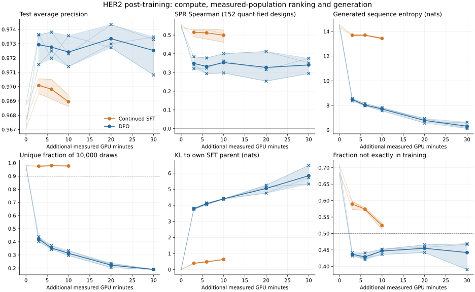

# HER2 p-IgGen SFT and DPO benchmark

Completed campaign, 2026-09-18. See the [fixed protocol](../specs/her2_hcdr3_benchmark.md).

p-IgGen is the generator. The CNN and additive model are auxiliary ranking comparators on measured populations; neither supplies rewards, preferences, or generator checkpoint selection.

The fixed diversity criteria accept 9/9 continued-SFT checkpoints and 0/15 DPO checkpoints. Selection remains the validation-frozen decision; the test and SPR outcomes below do not reselect a checkpoint.

At three additional GPU minutes, mean test AP is 0.9701 for continued SFT and 0.9729 for DPO. 9/9 matched-budget paired AP intervals have a positive lower bound. These row-resampling intervals do not account for dependence among neighboring sequences.

Continued SFT retains 97.18%-97.98% unique draws. DPO falls from 40.22%-43.86% at three minutes to 18.88%-19.07% at thirty minutes. Its thirty-minute KL from its own SFT parent is 5.326-6.477 nats: substantial distribution movement accompanies replicated mode collapse.

At the first matched budget, both methods rank 1,000/1,000 high-bin sequences at the top in every seed. That endpoint is saturated. DPO's mean AP is lower inside every reported training-distance stratum despite its higher aggregate AP. The aggregate bin-ranking gain alone therefore does not establish better within-stratum ranking or a measurable top-candidate affinity gain.

On 152 independent designs with a finite KD, continued-SFT correlations at three minutes are 0.491-0.528, versus 0.320-0.384 for DPO. Thirty-minute DPO correlations are 0.294-0.375. These are observed correlations on the same cohort, not three independent assay cohorts; no paired SPR difference interval was prespecified or computed.

Initial pretrained SFT parents have SPR correlations of 0.539-0.556; scratch controls have 0.536-0.585. Pretraining improves library-ranking point estimates under this schedule, but these results do not establish an affinity-transfer advantage over scratch or an improvement from additional post-training. This diagnostic comparison does not alter the frozen choices.

The planned binary SPR endpoint is **unavailable**. Of 695 independent designs, 152 have a finite KD, 96 have an I.C. binding observation without a reliable KD, 434 contain literal N/A, and 13 are blank. The workbook defines N.B. as no binding but contains no N.B. primary-cohort entries. N/A is not silently recoded as nonbinding. Consequently all 248 recognized binary outcomes are positive and AUROC is undefined. See the [assay availability audit](evidence/her2-assay-availability-2026-09-18.json).

Lines show seed means, bands show the range across three seeds, and faint lines show individual trajectories. Crosses mark raw checkpoints that fail diversity eligibility. These bands are not confidence intervals. The initial SFT cost is separate from the additional GPU budgets. DPO reference scoring is included in its budget.

## Compute comparison

| method        |   target_minutes |   actual_minutes |   test_ap |   ap_min |   ap_max |   spr_spearman |   spr_binding_auc |   entropy |   unique |   eligible_seeds |
|:--------------|-----------------:|-----------------:|----------:|---------:|---------:|---------------:|------------------:|----------:|---------:|-----------------:|
| continued_sft |           3.0000 |           3.0012 |    0.9701 |   0.9695 |   0.9705 |         0.5144 |               nan |   13.6918 |   0.9754 |                3 |
| continued_sft |           6.0000 |           6.0010 |    0.9698 |   0.9691 |   0.9705 |         0.5115 |               nan |   13.6956 |   0.9788 |                3 |
| continued_sft |          10.0000 |          10.0012 |    0.9689 |   0.9686 |   0.9694 |         0.4988 |               nan |   13.4314 |   0.9768 |                3 |
| dpo           |           3.0000 |           3.0014 |    0.9729 |   0.9715 |   0.9736 |         0.3484 |               nan |    8.4810 |   0.4204 |                0 |
| dpo           |           6.0000 |           6.0015 |    0.9728 |   0.9720 |   0.9738 |         0.3315 |               nan |    8.0322 |   0.3529 |                0 |
| dpo           |          10.0000 |          10.0019 |    0.9724 |   0.9714 |   0.9736 |         0.3530 |               nan |    7.7064 |   0.3126 |                0 |
| dpo           |          20.0000 |          20.0010 |    0.9733 |   0.9727 |   0.9743 |         0.3270 |               nan |    6.7780 |   0.2225 |                0 |
| dpo           |          30.0000 |          30.0010 |    0.9725 |   0.9708 |   0.9735 |         0.3402 |               nan |    6.3177 |   0.1896 |                0 |

## Ranking baselines and initial policies

| scorer                      |   test_ap |   test_auroc |   p1000 |   spr_spearman | spr_binding_auc   |
|:----------------------------|----------:|-------------:|--------:|---------------:|:------------------|
| cnn_3class_ensemble         |    0.9925 |       0.9960 |  1.0000 |         0.3732 |                   |
| cnn_3class_seed20260918     |    0.9917 |       0.9956 |  1.0000 |         0.1947 |                   |
| cnn_3class_seed20260919     |    0.9912 |       0.9953 |  1.0000 |         0.4193 |                   |
| cnn_3class_seed20260920     |    0.9904 |       0.9949 |  1.0000 |         0.3140 |                   |
| linear_3class               |    0.8417 |       0.9050 |  0.9870 |         0.1466 |                   |
| neg_wt_hamming              |    0.4509 |       0.6405 |  0.8000 |         0.4314 |                   |
| nn_label                    |    0.9795 |       0.9909 |  0.9940 |         0.4329 |                   |
| piggen_zeroshot             |    0.4717 |       0.6400 |  0.7350 |         0.1410 |                   |
| policy_scratch_seed20260918 |    0.9463 |       0.9639 |  1.0000 |         0.5362 |                   |
| policy_scratch_seed20260919 |    0.9493 |       0.9661 |  1.0000 |         0.5673 |                   |
| policy_scratch_seed20260920 |    0.9468 |       0.9644 |  0.9990 |         0.5846 |                   |
| policy_sft_seed20260918     |    0.9671 |       0.9790 |  1.0000 |         0.5453 |                   |
| policy_sft_seed20260919     |    0.9688 |       0.9798 |  1.0000 |         0.5561 |                   |
| policy_sft_seed20260920     |    0.9676 |       0.9793 |  1.0000 |         0.5386 |                   |
| prior                       |    0.3283 |       0.5000 |  0.4740 |       nan      |                   |

SPR Spearman uses only 152 finite positive KD measurements. Binary SPR AUROC is undefined in this release under the documented outcome rules; blank/NaN entries are unavailable metrics, not zero scores. No numerical KD is assigned to N/A, missing or unquantified records.

Precision-at-K uses the fixed lexicographic sequence tie-break. Its value for the constant prior therefore reflects that ordering and is not an estimate of the precision of random selection.

## Quantitative SPR uncertainty at fixed endpoints

| name                                 |   spr_quantitative_n |   spr_spearman |   spr_ci_low |   spr_ci_high |
|:-------------------------------------|---------------------:|---------------:|-------------:|--------------:|
| continued_sft_seed20260918_budget180 |                  152 |         0.5238 |       0.4060 |        0.6290 |
| continued_sft_seed20260919_budget180 |                  152 |         0.4912 |       0.3540 |        0.6204 |
| continued_sft_seed20260920_budget180 |                  152 |         0.5283 |       0.4004 |        0.6434 |
| dpo_seed20260918_budget180           |                  152 |         0.3409 |       0.1995 |        0.4735 |
| dpo_seed20260918_budget1800          |                  152 |         0.2944 |       0.1524 |        0.4367 |
| dpo_seed20260919_budget180           |                  152 |         0.3203 |       0.1689 |        0.4634 |
| dpo_seed20260919_budget1800          |                  152 |         0.3753 |       0.2269 |        0.5182 |
| dpo_seed20260920_budget180           |                  152 |         0.3840 |       0.2439 |        0.5127 |
| dpo_seed20260920_budget1800          |                  152 |         0.3507 |       0.1970 |        0.4966 |
| policy_sft_seed20260918              |                  152 |         0.5453 |       0.4325 |        0.6529 |
| policy_sft_seed20260919              |                  152 |         0.5561 |       0.4329 |        0.6640 |
| policy_sft_seed20260920              |                  152 |         0.5386 |       0.4095 |        0.6500 |

Each interval is a 95% percentile interval from 2,000 paired-row resamples of that scorer and the finite KD measurements. It is an interval for one correlation, not for the difference between two scorers. Quantification success can introduce selection bias relative to all 695 designs.

## Test ranking by distance to training sequences

| scorer               | train_distance   |   rows |   high_fraction |   mean_AP |   min_AP |   max_AP |   mean_AUROC |
|:---------------------|:-----------------|-------:|----------------:|----------:|---------:|---------:|-------------:|
| Continued SFT, 3 min | 1                |  70856 |          0.3318 |    0.9837 |   0.9832 |   0.9839 |       0.9913 |
| Continued SFT, 3 min | 2                |   6649 |          0.2991 |    0.8694 |   0.8669 |   0.8722 |       0.9295 |
| Continued SFT, 3 min | >=3              |   1147 |          0.2833 |    0.6838 |   0.6817 |   0.6863 |       0.8126 |
| DPO, 3 min           | 1                |  70856 |          0.3318 |    0.9812 |   0.9801 |   0.9818 |       0.9893 |
| DPO, 3 min           | 2                |   6649 |          0.2991 |    0.8628 |   0.8565 |   0.8683 |       0.9266 |
| DPO, 3 min           | >=3              |   1147 |          0.2833 |    0.6560 |   0.6526 |   0.6621 |       0.8089 |
| cnn_3class_ensemble  | 1                |  70856 |          0.3318 |    0.9957 |   0.9957 |   0.9957 |       0.9978 |
| cnn_3class_ensemble  | 2                |   6649 |          0.2991 |    0.9309 |   0.9309 |   0.9309 |       0.9654 |
| cnn_3class_ensemble  | >=3              |   1147 |          0.2833 |    0.7264 |   0.7264 |   0.7264 |       0.8498 |
| nn_label             | 1                |  70856 |          0.3318 |    0.9858 |   0.9858 |   0.9858 |       0.9938 |
| nn_label             | 2                |   6649 |          0.2991 |    0.8933 |   0.8933 |   0.8933 |       0.9528 |
| nn_label             | >=3              |   1147 |          0.2833 |    0.2833 |   0.2833 |   0.2833 |       0.5000 |

Generator rows summarize the three seeds at the first matched budget. Min/max describe seed spread. The nearest-neighbor comparator searches through Hamming distance two and returns the training prior beyond that; its distance >=3 row is therefore a constant-score fallback. Differences in overall ranking can reflect ordering between strata as well as within them, so the aggregate AP should not stand in for every stratum.

## Independent SPR within each source design method

| scorer               | design_method   |   finite_KD_rows |   mean_rho |   min_rho |   max_rho |
|:---------------------|:----------------|-----------------:|-----------:|----------:|----------:|
| Continued SFT, 3 min | ablang_all      |               29 |     0.3667 |    0.3241 |    0.4241 |
| Continued SFT, 3 min | ablang_one      |               23 |     0.1370 |    0.0494 |    0.2480 |
| Continued SFT, 3 min | blosum          |               63 |     0.5722 |    0.5474 |    0.5896 |
| Continued SFT, 3 min | esm_one         |               22 |     0.4143 |    0.3495 |    0.5189 |
| Continued SFT, 3 min | protein_mpnn    |               15 |     0.2619 |    0.1893 |    0.3500 |
| DPO, 3 min           | ablang_all      |               29 |     0.2959 |    0.1404 |    0.4266 |
| DPO, 3 min           | ablang_one      |               23 |    -0.0375 |   -0.2480 |    0.1206 |
| DPO, 3 min           | blosum          |               63 |     0.4219 |    0.3968 |    0.4588 |
| DPO, 3 min           | esm_one         |               22 |     0.2181 |    0.1485 |    0.2739 |
| DPO, 3 min           | protein_mpnn    |               15 |    -0.1369 |   -0.2464 |   -0.0464 |
| DPO, 30 min          | ablang_all      |               29 |     0.2547 |    0.1640 |    0.3212 |
| DPO, 30 min          | ablang_one      |               23 |     0.0985 |    0.0049 |    0.2836 |
| DPO, 30 min          | blosum          |               63 |     0.3273 |    0.1822 |    0.4123 |
| DPO, 30 min          | esm_one         |               22 |     0.2626 |    0.1327 |    0.3563 |
| DPO, 30 min          | protein_mpnn    |               15 |     0.0571 |   -0.0357 |    0.1393 |
| Initial SFT          | ablang_all      |               29 |     0.4043 |    0.3813 |    0.4483 |
| Initial SFT          | ablang_one      |               23 |     0.2424 |    0.1739 |    0.3281 |
| Initial SFT          | blosum          |               63 |     0.6013 |    0.5953 |    0.6053 |
| Initial SFT          | esm_one         |               22 |     0.4832 |    0.3721 |    0.5460 |
| Initial SFT          | protein_mpnn    |               15 |     0.3048 |    0.2571 |    0.3821 |
| cnn_3class_ensemble  | ablang_all      |               29 |     0.2567 |    0.2567 |    0.2567 |
| cnn_3class_ensemble  | ablang_one      |               23 |    -0.0316 |   -0.0316 |   -0.0316 |
| cnn_3class_ensemble  | blosum          |               63 |     0.4234 |    0.4234 |    0.4234 |
| cnn_3class_ensemble  | esm_one         |               22 |     0.2671 |    0.2671 |    0.2671 |
| cnn_3class_ensemble  | protein_mpnn    |               15 |    -0.3750 |   -0.3750 |   -0.3750 |
| nn_label             | ablang_all      |               29 |     0.1337 |    0.1337 |    0.1337 |
| nn_label             | ablang_one      |               23 |     0.3129 |    0.3129 |    0.3129 |
| nn_label             | blosum          |               63 |     0.4408 |    0.4408 |    0.4408 |
| nn_label             | esm_one         |               22 |     0.1017 |    0.1017 |    0.1017 |
| nn_label             | protein_mpnn    |               15 |     0.3712 |    0.3712 |    0.3712 |

The generator rows summarize three training seeds at fixed descriptive endpoints (initial SFT, the first matched budget and the largest DPO budget). Min/max describe seed spread, not confidence intervals. Each design-method stratum uses only its own finite KD measurements. These strata reveal whether pooled ranking depends on differences between the source design methods.

## Every continuation checkpoint

| method        |          seed |   target_minutes |   val_high_nll |   test_ap |   p1000 |   parent_relative_ap |   spr_spearman |   spr_parent_relative_spearman |   kl_parent |   mean_hamming |   unique |   max_frequency |   not_in_train | eligible   |
|:--------------|--------------:|-----------------:|---------------:|----------:|--------:|---------------------:|---------------:|-------------------------------:|------------:|---------------:|---------:|----------------:|---------------:|:-----------|
| continued_sft | 20260918.0000 |           3.0000 |         1.4989 |    0.9695 |  1.0000 |               0.5244 |         0.5238 |                         0.1078 |      0.3952 |         7.5825 |   0.9765 |          0.0003 |         0.5967 | True       |
| continued_sft | 20260918.0000 |           6.0000 |         1.5042 |    0.9691 |  1.0000 |               0.5422 |         0.5308 |                         0.1261 |      0.4720 |         7.5752 |   0.9796 |          0.0004 |         0.5790 | True       |
| continued_sft | 20260918.0000 |          10.0000 |         1.5269 |    0.9686 |  1.0000 |               0.6208 |         0.5270 |                         0.1744 |      0.6249 |         7.5446 |   0.9776 |          0.0003 |         0.5307 | True       |
| continued_sft | 20260919.0000 |           3.0000 |         1.4986 |    0.9705 |  1.0000 |               0.6036 |         0.4912 |                         0.0391 |      0.4083 |         7.5522 |   0.9718 |          0.0003 |         0.5728 | True       |
| continued_sft | 20260919.0000 |           6.0000 |         1.5053 |    0.9705 |  1.0000 |               0.6285 |         0.4781 |                         0.0226 |      0.4691 |         7.5483 |   0.9771 |          0.0003 |         0.5699 | True       |
| continued_sft | 20260919.0000 |          10.0000 |         1.5252 |    0.9694 |  1.0000 |               0.6702 |         0.4610 |                         0.0502 |      0.6281 |         7.5352 |   0.9790 |          0.0003 |         0.5291 | True       |
| continued_sft | 20260920.0000 |           3.0000 |         1.4965 |    0.9702 |  1.0000 |               0.6340 |         0.5283 |                         0.0664 |      0.3703 |         7.5338 |   0.9780 |          0.0003 |         0.5984 | True       |
| continued_sft | 20260920.0000 |           6.0000 |         1.5054 |    0.9698 |  1.0000 |               0.6491 |         0.5256 |                         0.0502 |      0.4913 |         7.5799 |   0.9798 |          0.0005 |         0.5725 | True       |
| continued_sft | 20260920.0000 |          10.0000 |         1.5264 |    0.9688 |  1.0000 |               0.6762 |         0.5084 |                         0.0337 |      0.6457 |         7.5501 |   0.9739 |          0.0003 |         0.5124 | True       |
| dpo           | 20260918.0000 |          20.0000 |         4.2023 |    0.9727 |  1.0000 |               0.9559 |         0.2537 |                         0.0246 |      4.7547 |         6.2470 |   0.2367 |          0.0434 |         0.4653 | False      |
| dpo           | 20260918.0000 |           3.0000 |         3.1999 |    0.9736 |  1.0000 |               0.9509 |         0.3409 |                         0.0705 |      3.8132 |         6.1841 |   0.4203 |          0.0069 |         0.4359 | False      |
| dpo           | 20260918.0000 |          30.0000 |         4.6240 |    0.9708 |  1.0000 |               0.9545 |         0.2944 |                         0.0219 |      5.7137 |         6.3114 |   0.1892 |          0.1175 |         0.4688 | False      |
| dpo           | 20260918.0000 |           6.0000 |         3.6233 |    0.9720 |  1.0000 |               0.9519 |         0.2938 |                        -0.0308 |      4.0900 |         6.2870 |   0.3720 |          0.0152 |         0.4409 | False      |
| dpo           | 20260918.0000 |          10.0000 |         3.8542 |    0.9736 |  1.0000 |               0.9550 |         0.2973 |                         0.0323 |      4.4195 |         6.1959 |   0.3084 |          0.0126 |         0.4515 | False      |
| dpo           | 20260919.0000 |          20.0000 |         4.3455 |    0.9743 |  1.0000 |               0.9602 |         0.3148 |                         0.0825 |      5.1328 |         6.0490 |   0.2039 |          0.0301 |         0.4420 | False      |
| dpo           | 20260919.0000 |           3.0000 |         3.1664 |    0.9736 |  1.0000 |               0.9529 |         0.3203 |                         0.0156 |      3.8133 |         6.0288 |   0.4022 |          0.0184 |         0.4317 | False      |
| dpo           | 20260919.0000 |          30.0000 |         4.5597 |    0.9733 |  1.0000 |               0.9604 |         0.3753 |                         0.1800 |      5.3256 |         6.2276 |   0.1888 |          0.0243 |         0.3903 | False      |
| dpo           | 20260919.0000 |           6.0000 |         3.5001 |    0.9738 |  1.0000 |               0.9531 |         0.3233 |                        -0.0063 |      4.1474 |         6.0337 |   0.3439 |          0.0104 |         0.4254 | False      |
| dpo           | 20260919.0000 |          10.0000 |         3.8002 |    0.9723 |  1.0000 |               0.9541 |         0.3607 |                         0.0893 |      4.4051 |         6.2580 |   0.2963 |          0.0151 |         0.4362 | False      |
| dpo           | 20260920.0000 |          20.0000 |         4.1628 |    0.9730 |  1.0000 |               0.9579 |         0.4124 |                         0.2152 |      5.2525 |         6.5474 |   0.2269 |          0.0410 |         0.4575 | False      |
| dpo           | 20260920.0000 |           3.0000 |         3.2499 |    0.9715 |  1.0000 |               0.9506 |         0.3840 |                         0.1656 |      3.7394 |         6.0931 |   0.4386 |          0.0130 |         0.4418 | False      |
| dpo           | 20260920.0000 |          30.0000 |         4.7264 |    0.9735 |  1.0000 |               0.9609 |         0.3507 |                         0.1360 |      6.4770 |         6.5827 |   0.1907 |          0.0742 |         0.4669 | False      |
| dpo           | 20260920.0000 |           6.0000 |         3.5379 |    0.9725 |  1.0000 |               0.9526 |         0.3774 |                         0.1100 |      4.0337 |         6.2175 |   0.3427 |          0.0155 |         0.4205 | False      |
| dpo           | 20260920.0000 |          10.0000 |         3.6965 |    0.9714 |  1.0000 |               0.9528 |         0.4008 |                         0.1081 |      4.3804 |         6.3619 |   0.3332 |          0.0126 |         0.4524 | False      |

Parent-relative scores are policy log density minus the same SFT parent that DPO used as its reference. They are a declared diagnostic. Checkpoint selection used raw validation density ranking and the fixed diversity criteria.

## Matched-budget paired differences

|           seed |   budget_minutes |   DPO_minus_SFT_AP |   CI_low |   CI_high |
|---------------:|-----------------:|-------------------:|---------:|----------:|
| 20260918.00000 |          3.00000 |            0.00412 |  0.00290 |   0.00525 |
| 20260918.00000 |          6.00000 |            0.00285 |  0.00158 |   0.00406 |
| 20260918.00000 |         10.00000 |            0.00495 |  0.00369 |   0.00617 |
| 20260919.00000 |          3.00000 |            0.00306 |  0.00180 |   0.00428 |
| 20260919.00000 |          6.00000 |            0.00330 |  0.00208 |   0.00458 |
| 20260919.00000 |         10.00000 |            0.00288 |  0.00160 |   0.00422 |
| 20260920.00000 |          3.00000 |            0.00137 |  0.00017 |   0.00253 |
| 20260920.00000 |          6.00000 |            0.00268 |  0.00144 |   0.00392 |
| 20260920.00000 |         10.00000 |            0.00260 |  0.00133 |   0.00390 |

Intervals are 95% paired percentile intervals from 1,000 row resamples of the test population. They describe row-resampling uncertainty, separately from variation between training seeds. They do not account for dependence among nearby sequences or establish generalization to a different target or scaffold.

## Frozen checkpoint decisions

| run                        |   budget_minutes | selected                             |   validation_ap |
|:---------------------------|-----------------:|:-------------------------------------|----------------:|
| continued_sft_seed20260918 |           3.0000 | continued_sft_seed20260918_budget180 |          0.9686 |
| continued_sft_seed20260918 |           6.0000 | continued_sft_seed20260918_budget180 |          0.9686 |
| continued_sft_seed20260918 |          10.0000 | continued_sft_seed20260918_budget180 |          0.9686 |
| continued_sft_seed20260919 |           3.0000 | continued_sft_seed20260919_budget180 |          0.9692 |
| continued_sft_seed20260919 |           6.0000 | continued_sft_seed20260919_budget180 |          0.9692 |
| continued_sft_seed20260919 |          10.0000 | continued_sft_seed20260919_budget180 |          0.9692 |
| continued_sft_seed20260920 |           3.0000 | continued_sft_seed20260920_budget180 |          0.9692 |
| continued_sft_seed20260920 |           6.0000 | continued_sft_seed20260920_budget180 |          0.9692 |
| continued_sft_seed20260920 |          10.0000 | continued_sft_seed20260920_budget180 |          0.9692 |
| dpo_seed20260918           |          20.0000 | none eligible                        |        nan      |
| dpo_seed20260918           |           3.0000 | none eligible                        |        nan      |
| dpo_seed20260918           |          30.0000 | none eligible                        |        nan      |
| dpo_seed20260918           |           6.0000 | none eligible                        |        nan      |
| dpo_seed20260918           |          10.0000 | none eligible                        |        nan      |
| dpo_seed20260919           |          20.0000 | none eligible                        |        nan      |
| dpo_seed20260919           |           3.0000 | none eligible                        |        nan      |
| dpo_seed20260919           |          30.0000 | none eligible                        |        nan      |
| dpo_seed20260919           |           6.0000 | none eligible                        |        nan      |
| dpo_seed20260919           |          10.0000 | none eligible                        |        nan      |
| dpo_seed20260920           |          20.0000 | none eligible                        |        nan      |
| dpo_seed20260920           |           3.0000 | none eligible                        |        nan      |
| dpo_seed20260920           |          30.0000 | none eligible                        |        nan      |
| dpo_seed20260920           |           6.0000 | none eligible                        |        nan      |
| dpo_seed20260920           |          10.0000 | none eligible                        |        nan      |

Selections were fixed using validation AP and the declared diversity gates before model-based final test and SPR evaluation. An empty budget stays empty; no parent or failed checkpoint is silently promoted.

## Initial SFT validation

| run                  |   epoch |   val_high_nll |   val_ap_diagnostic |
|:---------------------|--------:|---------------:|--------------------:|
| scratch_seed20260918 |       1 |         1.6954 |              0.8787 |
| scratch_seed20260918 |       3 |         1.5826 |              0.9267 |
| scratch_seed20260918 |       5 |         1.5415 |              0.9457 |
| scratch_seed20260919 |       1 |         1.7008 |              0.8676 |
| scratch_seed20260919 |       3 |         1.5790 |              0.9320 |
| scratch_seed20260919 |       5 |         1.5382 |              0.9482 |
| scratch_seed20260920 |       1 |         1.7094 |              0.8677 |
| scratch_seed20260920 |       3 |         1.5847 |              0.9265 |
| scratch_seed20260920 |       5 |         1.5427 |              0.9463 |
| sft_seed20260918     |       1 |         1.5653 |              0.9422 |
| sft_seed20260918     |       3 |         1.4920 |              0.9659 |
| sft_seed20260918     |       5 |         1.5023 |              0.9693 |
| sft_seed20260919     |       1 |         1.5640 |              0.9380 |
| sft_seed20260919     |       3 |         1.4888 |              0.9677 |
| sft_seed20260919     |       5 |         1.5018 |              0.9698 |
| sft_seed20260920     |       1 |         1.5582 |              0.9404 |
| sft_seed20260920     |       3 |         1.4867 |              0.9669 |
| sft_seed20260920     |       5 |         1.5008 |              0.9701 |

Initial checkpoints were selected by high-bin validation NLL. Their validation AP was diagnostic only. No best seed was selected.

## Generated matches to measured held-out sequences

| name                                 |   test_matches |   test_unique_matches |   test_match_high |   heldout_matches |   heldout_high |   not_in_train |   outside_library |
|:-------------------------------------|---------------:|----------------------:|------------------:|------------------:|---------------:|---------------:|------------------:|
| continued_sft_seed20260918_budget180 |            467 |                   454 |            0.9872 |               938 |         0.9904 |         0.5967 |            0.5029 |
| continued_sft_seed20260918_budget360 |            442 |                   429 |            0.9977 |               883 |         0.9977 |         0.5790 |            0.4907 |
| continued_sft_seed20260918_budget600 |            457 |                   444 |            0.9956 |               918 |         0.9956 |         0.5307 |            0.4389 |
| continued_sft_seed20260919_budget180 |            463 |                   450 |            0.9978 |               917 |         0.9945 |         0.5728 |            0.4811 |
| continued_sft_seed20260919_budget360 |            439 |                   435 |            0.9954 |               872 |         0.9931 |         0.5699 |            0.4827 |
| continued_sft_seed20260919_budget600 |            444 |                   430 |            0.9932 |               880 |         0.9955 |         0.5291 |            0.4411 |
| continued_sft_seed20260920_budget180 |            470 |                   459 |            0.9936 |               931 |         0.9957 |         0.5984 |            0.5053 |
| continued_sft_seed20260920_budget360 |            464 |                   457 |            0.9957 |               942 |         0.9968 |         0.5725 |            0.4783 |
| continued_sft_seed20260920_budget600 |            420 |                   412 |            0.9952 |               830 |         0.9952 |         0.5124 |            0.4294 |
| dpo_seed20260918_budget1200          |            773 |                   207 |            1.0000 |              1609 |         1.0000 |         0.4653 |            0.3044 |
| dpo_seed20260918_budget180           |            821 |                   338 |            1.0000 |              1756 |         1.0000 |         0.4359 |            0.2603 |
| dpo_seed20260918_budget1800          |           1945 |                   160 |            1.0000 |              2875 |         1.0000 |         0.4688 |            0.1813 |
| dpo_seed20260918_budget360           |            793 |                   319 |            1.0000 |              1769 |         1.0000 |         0.4409 |            0.2640 |
| dpo_seed20260918_budget600           |            800 |                   275 |            1.0000 |              1795 |         1.0000 |         0.4515 |            0.2720 |
| dpo_seed20260919_budget1200          |            854 |                   195 |            1.0000 |              1633 |         1.0000 |         0.4420 |            0.2787 |
| dpo_seed20260919_budget180           |            973 |                   320 |            1.0000 |              1956 |         1.0000 |         0.4317 |            0.2361 |
| dpo_seed20260919_budget1800          |            871 |                   190 |            1.0000 |              1866 |         1.0000 |         0.3903 |            0.2037 |
| dpo_seed20260919_budget360           |            909 |                   307 |            1.0000 |              1819 |         1.0000 |         0.4254 |            0.2435 |
| dpo_seed20260919_budget600           |            886 |                   278 |            1.0000 |              1798 |         1.0000 |         0.4362 |            0.2564 |
| dpo_seed20260920_budget1200          |            706 |                   189 |            1.0000 |              1726 |         1.0000 |         0.4575 |            0.2849 |
| dpo_seed20260920_budget180           |            749 |                   370 |            1.0000 |              1674 |         1.0000 |         0.4418 |            0.2744 |
| dpo_seed20260920_budget1800          |            966 |                   157 |            1.0000 |              1603 |         1.0000 |         0.4669 |            0.3066 |
| dpo_seed20260920_budget360           |            784 |                   301 |            1.0000 |              1926 |         1.0000 |         0.4205 |            0.2279 |
| dpo_seed20260920_budget600           |            756 |                   268 |            1.0000 |              1831 |         1.0000 |         0.4524 |            0.2693 |
| piggen_zeroshot                      |              0 |                     0 |          nan      |                 0 |       nan      |         1.0000 |            1.0000 |
| policy_scratch_seed20260918          |            382 |                   365 |            0.9921 |               799 |         0.9950 |         0.7817 |            0.7018 |
| policy_scratch_seed20260919          |            444 |                   424 |            0.9955 |               858 |         0.9965 |         0.7733 |            0.6875 |
| policy_scratch_seed20260920          |            374 |                   367 |            0.9947 |               784 |         0.9949 |         0.7873 |            0.7089 |
| policy_sft_seed20260918              |            507 |                   488 |            0.9941 |               991 |         0.9939 |         0.6776 |            0.5785 |
| policy_sft_seed20260919              |            413 |                   402 |            0.9903 |               884 |         0.9943 |         0.6858 |            0.5974 |
| policy_sft_seed20260920              |            467 |                   446 |            1.0000 |               918 |         0.9967 |         0.7067 |            0.6149 |

`test_matches` and `test_match_high` use only the test catalogue; `test_unique_matches` counts distinct matching cores. `heldout_matches` counts draws whose exact sequence appears in the published validation or test catalogue. `heldout_high` is the high-bin fraction only within those matches. This conditioning favors measured library members and does not estimate the binding rate of all generated sequences. Duplicate draws count repeatedly here; they are not independent assay replicates. `not_in_train` is exact-sequence novelty, not functional novelty. `outside_library` is the fraction absent from all three published library splits; it does not establish absence from pretraining or other sources.

## Initial-policy sampling

| name                        |   entropy |   unique |   max_frequency |   not_in_train |   mean_hamming |
|:----------------------------|----------:|---------:|----------------:|---------------:|---------------:|
| piggen_zeroshot             |   23.7149 |   0.9992 |          0.0003 |         1.0000 |         9.1537 |
| policy_scratch_seed20260918 |   15.4195 |   0.9784 |          0.0007 |         0.7817 |         7.5549 |
| policy_scratch_seed20260919 |   15.3922 |   0.9811 |          0.0005 |         0.7733 |         7.5440 |
| policy_scratch_seed20260920 |   15.4507 |   0.9815 |          0.0004 |         0.7873 |         7.5091 |
| policy_sft_seed20260918     |   14.2849 |   0.9763 |          0.0004 |         0.6776 |         7.5064 |
| policy_sft_seed20260919     |   14.4630 |   0.9791 |          0.0006 |         0.6858 |         7.5512 |
| policy_sft_seed20260920     |   14.5589 |   0.9810 |          0.0004 |         0.7067 |         7.4717 |

## Numerical evaluation amendment

After fitting and before final selection, one automatic-SDPA sampler/scorer comparison failed its FP32 tolerance. An FP64 diagnosis found full teacher forcing and autoregression agreeing to 8.53e-14 nats on the worst rows. All 31 policies were then revalidated uniformly using native math SDPA, retaining FP32, the original tolerances, weights, seeds and selection rules. Final scoring uses the same backend. The original partial results are preserved separately. The [numerical audit](evidence/her2-numerical-audit-2026-09-18.json) and the [dated protocol amendment](../specs/her2_hcdr3_benchmark.md#9-numerical-evaluation-amendment--2026-09-18) document the change. The final freeze binds the added evaluation driver and backend through a separate manifest.

## Interpretation limits

- Library labels are high/mid/low binding bins, not numerical KD. The fixed-scaffold task edits ten HCDR3 positions and has no antigen encoder.
- The random split is dominated by close training neighbors. Proximity-stratified results and paired bootstrap intervals are retained in the evidence.
- Independent SPR evaluates other authors' designs, after removing exact library overlaps. It does not measure the binding of our newly generated sequences. Within-method results reduce, but do not remove, author selection bias.
- Generated catalogue hits are lookups of existing measurements; unmeasured outputs receive no inferred experimental affinity. Repeated draws are not new assay replicates.
- Diversity thresholds are distributional checks, not proof of functional diversity or absence of overfitting. Three seeds do not resolve every small effect.
- Equal GPU time is not equal update count or label information: DPO also reads low-bin examples, while continued SFT trains on eligible high-bin examples.
- One DPO beta and learning-rate schedule were tested. The scaling curves characterize this configuration, not the best attainable performance of DPO after hyperparameter tuning or a different objective.
- p-IgGen's HER2 pretraining exposure remains unresolved. The scratch control tests random initialization at the same training schedule, not a tuned scratch optimum.
- Initial source auditing read aggregate counts and two examples from every split, including test. Model-based test and SPR evaluation followed the final selection freeze.
- The workbook identifies SPR; the upstream README abstract describes BLI. The metadata discrepancy is retained. Absci Corporation (2023) data were used solely for a support-compatibility audit, not these training or evaluation results.

## Reproducibility

The [evidence snapshot](evidence/her2-posttrain-2026-09-18.json) retains every scorer, distance stratum, paired interval, seed result, selection decision, exposure count and source/checkpoint digest. [Scaling data](evidence/her2-posttrain-scaling-2026-09-18.csv) are available separately. Weights, draw files and full logs remain under `outputs/her2_posttrain_20260918/`.

The [final integrity audit](evidence/her2-final-integrity-2026-09-18.json) verified all 35 frozen model/baseline artifacts, all 31 draw files, the evaluation artifacts, unchanged selections and scientific-code hashes, and the separately bound numerical driver. Before fitting, 1,984 repository tests passed (3 skipped), with native scoring/gradient and synthetic-stage checks. The numerical amendment subsequently passed 37 driver/runner checks and all 31 native sampler/scorer checks at the original tolerance.
