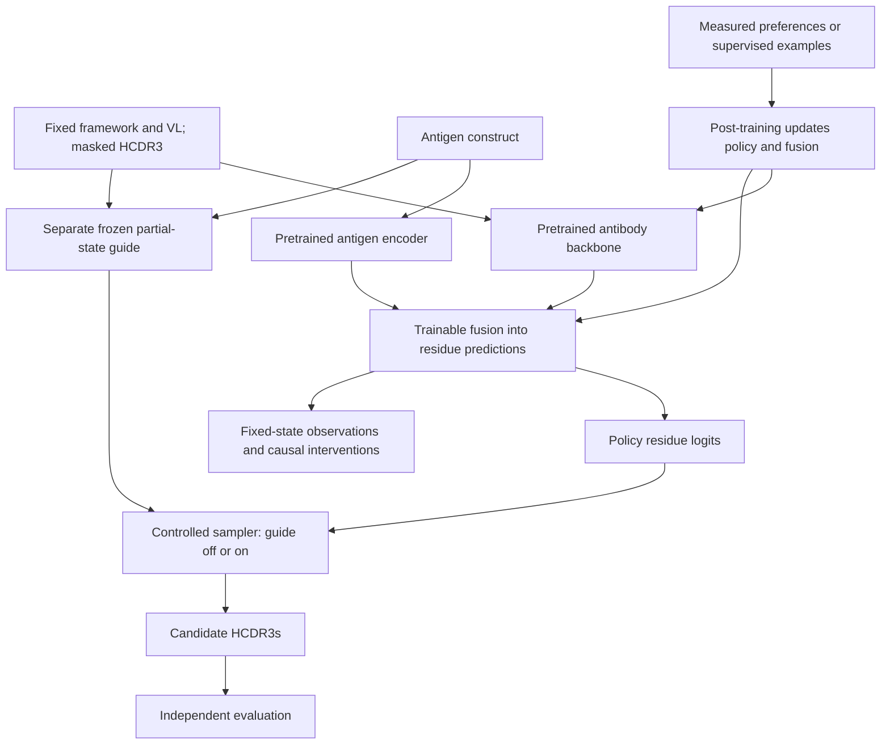

# Research design and implementation plan

[Project overview](../README.md)

This project studies how antigen information changes antibody generation, how
post-training changes that behavior, and how an external property guide interacts
with the resulting policy. The initial task is **fixed-length HCDR3 editing with
the heavy-chain framework and light-chain context held fixed**.

**Plan (2026-09-09):** start with a pretrained protein model, adapt VH/VL behavior
where needed, and add antigen information to residue prediction. Pretrained
initialization lets the project focus on antibody adaptation, antigen conditioning,
and steering. VH/VL understanding and antigen-specific design still require
explicit data and held-out tests. Antibody pretraining from scratch is an optional
research control.

**First milestone:** with antibody context fixed, changing the antigen changes
HCDR3 predictions in agreement with held-out measurements. This evidence is needed
before making post-training or interpretability claims. A joint embedding or a
better compatibility classifier alone does not show that the policy uses the
antigen. A response to an unmeasured antigen swap is also insufficient for this
milestone.

The pretrained antibody policy is not yet integrated.
[Decision 0003](../specs/decisions/0003-pretrained-conditioned-policy.md) records the
accepted plan; the [migration specification](../specs/pretrained_conditioned_policy.md)
defines code boundaries, work order, and completion criteria.

## Current implementation

| Capability | Implemented | Planned |
|---|---|---|
| Data and evaluation | OAS/ASD preparation, target identity and leakage audits, frozen inputs and HCDR3 contrast scoring | A verified antigen-variant pilot with measurements and sealed evaluation labels |
| Antibody policy | Custom antibody MLM and VH/VL refinement | Pretrained antibody backbone, native tokenizer/head, loading and provenance |
| Antigen fusion | Cross-attention into antibody residue logits; optional frozen/LoRA ESM antigen encoder | Adaptation and measurement-based conditioning criteria for the pretrained policy |
| Sampling and guidance | Single-pass and iterative HCDR3 infill; optional external guide | Same sampler with guidance off/on, independent antigen inputs, replayable traces |
| Generative objective | MLM, partial-state masking and mask-rate schedules | Specified masked-diffusion objective and compatible sampler |
| Post-training | No preference trainer | Supervised baseline, then a tested diffusion preference estimator |
| Interpretability | Synthetic antigen-pathway probe | Fixed-state activation capture and causal fusion interventions; SAEs later |

The existing ESM option replaces only the antigen encoder; the antibody backbone
remains custom. Implemented capabilities do not establish that a trained checkpoint
meets the scientific criteria.

**Current readiness:** this checkout has no antibody-antigen corpus. The three
benchmark manifests contain owner placeholders and empty file lists, and the
training GPU/VRAM has not been recorded. Current M01 work includes acquiring and
documenting data, measuring training hardware, and preparing interfaces. Run
`nvidia-smi --query-gpu=name,memory.total --format=csv` on the training machine.
Neither the local CPU Mac nor the earlier 4 GB planning assumption is sufficient
to select a backbone. M03 conditional training requires M01's verified data and
hardware evidence; a working adapter alone is insufficient.

## Research roadmap

1. **Finalize one conditional pilot and integrate one pretrained backbone.** Fix the
   weights/revision, tokenizer, objective, usage terms, biological cases, and actual
   compute budget. DPLM and ESM-family models, including VESM, are candidates; none
   has been selected. Preserve upstream residue predictions before adding fusion.
2. **Adapt pairing and antigen conditioning.** Train the model to use antigen
   information in residue prediction and address measured VH/VL deficits while
   preserving earlier capabilities. With guidance off, evaluate the correct
   antigen, matched substitutions, and measured antigen variants, including a
   fully masked HCDR3.
3. **Specify the generative process.** Continue a conditioned MLM under a specified
   masked-diffusion objective, or adapt a diffusion checkpoint under its native
   objective. Masked diffusion supports completion of an editable region from
   varying amounts of observed context, with a specified stochastic process.
   Evaluate it against a matched partial-state control and recheck conditioning.
   Diffusion is not required for all valid post-training methods.
4. **Establish guidance and causal baselines.** Validate a separate guide on the
   partial states it will encounter. Capture fixed-state activations before
   post-training and intervene on the antigen-to-residue pathway.
5. **Compare post-training and guidance.** Start with supervised continuation,
   then evaluate a specified preference method on trustworthy pairs. Compare the
   policy before and after post-training with guidance off/on, and repeat the
   causal probes.

For a pretrained diffusion backbone, specify the generative process before
conditional training. A second round of general-protein pretraining is not
required. SAEs, variable-length design, structure co-design, and broad optimizer
sweeps follow evidence from the initial experiment.

The longer-term aim is interpretable antibody design: understand what the model
has learned, validate antigen conditioning against independent measurements, use
validated signals to steer generation through sampling and weight updates, and
test whether sparse internal features add useful diagnostics. Architecture,
supervision, splits, and representations may change as data and experiments develop.

## Planned architecture

The current custom model provides reusable fusion and infilling components. The
pretrained antibody path and experiment runner still need implementation.

The guide supplies predictions to the sampler; its hidden representations do not
enter the policy. Post-training and causal interventions are separate experiments
on the policy. SAE discovery is a later diagnostic option.

## Steering and interpretation

| Intervention | What changes | Evidence needed |
|---|---|---|
| Antigen conditioning | The policy's predictions at a fixed antibody state | Measured antigen response beyond identity and study shortcuts |
| Inference-time guidance | The sampling distribution using a separate predictor | Improvement under a controlled sampler and independent evaluation |
| Post-training | Policy parameters, including any trainable fusion | Gains with guidance off, preserving conditioning and earlier capabilities |
| Causal interpretation | Selected activations or antigen access during a diagnostic | Controlled transfer or ablation of a reproducible policy response |

Guidance reweights candidate probabilities. Finite multiplicative weights leave
zero probabilities at zero, but can amplify small nonzero probabilities if the
guide favors them enough. The reachability probe measures these limits for a
specified state, guide, and scoring rule. Its results do not apply to every
possible generation path.

With fixed inputs and deterministic evaluation, an external guide leaves a frozen
policy's forward activations unchanged. It changes sampled residues and therefore
later inputs and activations. Fixed-state interventions examine what the policy
computes at a given input; trajectory analysis examines which inputs the sampler
visits. Free-running trajectories alone cannot show that the policy learned the
guide's representation.

## Main experiment

Use one conditioned parent policy, a separately trained frozen guide, and the same
sampling protocol in all four arms:

| Policy | Guide off | Guide on |
|---|---|---|
| Before post-training | A: conditioning baseline | B: guidance effect |
| After post-training | C: learned policy change | D: combined intervention |

Measure `C - A`, `B - A`, and `D - C` on withheld experimental outcomes. Vary and
cross the policy's and guide's antigen inputs independently to identify which
component supplies specificity. Include sampling-plus-reranking and
supervised-continuation controls with declared budgets. Generated candidates
require measurements before they can be called experimentally validated
improvements.

For mechanistic analysis, fix corrupted antibody states, masks, positions, and time
levels. Compare antigen contexts and intervene on aligned fusion activations within
each checkpoint, before and after post-training. Probe accuracy, attention maps,
and better guide scores alone cannot establish causal antigen use or improved
binding.

## Post-training requirements

**Status: planned, not implemented.** The policy, external guide, frozen preference
reference, and final evaluator have distinct roles. Preferred and dispreferred
examples must share antigen, framework, light-chain context, and edit length, with
comparable assay conditions. Uncertainty and censoring must permit an ordering.

Before implementing diffusion-DPO training, `specs/masked_diffusion.md` and
`specs/diffusion_dpo.md` must define the process, estimator, policy/reference
corruption reuse, winner/loser coupling, weighting/reduction, sampling budget,
reference behavior, and enumerable toy tests. Neither document exists yet, and the
migration specification does not replace them. The post-training objective and
probability estimator must be consistent with the generative process;
`specs/diffusion_dpo.md` will be the authority for the planned estimator.

MLM pseudo-likelihood, fully masked marginal scores, trajectory log probabilities,
and the evaluation-time order-mixture `E-hat` are distinct quantities. Using them
in DPO does not make them exact diffusion sequence log probabilities. `E-hat` is an
evaluation score, not an approved preference objective. Distinguish the
variational-surrogate gap from the bias caused by noisy estimates inside a
nonlinear preference loss. See
[diffusion and post-training boundaries](../specs/pretrained_conditioned_policy.md#diffusion-and-post-training-boundaries).

Supervised continuation on measured desirable examples is the first weight-update
baseline. DPO/VRPO is a candidate when trustworthy pairs exist. GRPO and iterative
preference loops also require reliable evaluation of new candidates and estimators
compatible with the sampler. The guide's scores cannot both define success and
demonstrate biological improvement from optimizing against that guide.
